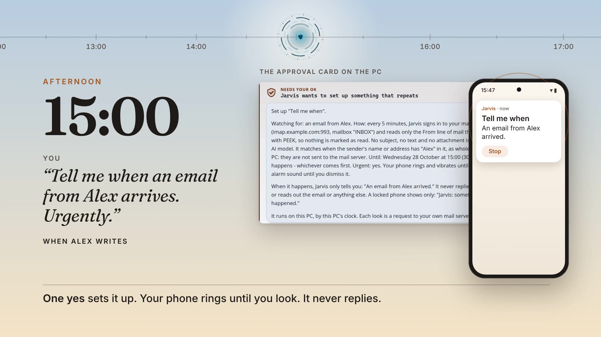

# Epic-Jarvis

A personal assistant that runs on your own Windows PC, with an Android app to
reach it from your phone. Built on OpenJarvis and heavily extended.
Non-commercial, for one owner.

## Launch video

**Tap the picture to watch v5** (30 seconds, sound on; every spoken line is on
screen). It opens the video file, and GitHub plays it in the browser. On a
phone held upright, watch [the 15-second cut](videos/v5/jarvis-launch-v5-vertical.mp4).

One day with Jarvis, from the morning briefing to Standby at night, in one
continuous shot: a focus session, a "Tell me when" alert that rings your phone,
and a memory that learns from your own words. Every screen is the real desktop
app, with made-up examples.

Every version is kept in [`videos/`](videos/), with the plan and the project
needed to make it again: [v1](videos/v1/jarvis-launch-v1.mp4),
[v2](videos/v2/jarvis-launch-v2.mp4), [v3](videos/v3/jarvis-launch-v3.mp4),
[v4](videos/v4/jarvis-launch-v4.mp4).

## How it fits together

- **Backend.** A Python server on the PC. It does the work, and uses a local
  model through Ollama on the PC's own graphics card.
- **Desktop app** (`jarvis-desktop/`). A Windows 11 app built with Tauri. It
  has a quick-ask bar (`Alt+Space`), a full HUD window, a desktop widget, and a
  tray menu.
- **Phone app** (`jarvis-client/`). An Android app that connects to the PC over
  your private network, either Tailscale or NordVPN Meshnet.

## What it can do

- **Chat** with the local model. Answers stream in as they are written.
  Cloud models are optional, and never see anything private.
- **Ask before acting.** Anything risky waits for your decision, and you can
  approve or deny it on the PC or the phone. Nothing is ever auto-approved, and
  there is no "approve all".
- **Remember things.** Jarvis proposes facts, and you review them before they
  are kept. Old facts are retired rather than deleted, so Jarvis knows both
  what is true now and what was true before.
- **Stay quiet.** Jarvis may speak up on its own only a few times a day.
  Anything else waits in a daily digest.
- **Show what it is doing.** An animated reactor face shows its state:
  listening, thinking, speaking, or waiting on you. There are 20 face designs,
  and the faces and colours match on the PC and the phone.
- **Take voice**, by push-to-talk on the phone. It checks it is your voice
  before anything is transcribed.
- **Look how you like.** You choose the theme, the face, the colours and the
  layout. Appearance settings on the phone never change the desktop's
  configuration.

## Ground rules

1. Email, files, credentials and memory stay on the local model.
2. No public tunnel. It is reachable only over your private network, and needs
   a pairing token.
3. API keys are allowed. They are never logged, and each one is sent only to
   the service it belongs to.
4. Nothing is auto-approved, and acting is blocked while the connection to the
   PC is stale.
5. The phone app is installed by hand (sideloaded), never through the Play
   Store.

## Getting started

- **Set it up:** [`docs/INSTALL.md`](docs/INSTALL.md).
- **Install the phone app:** download the APK from the
  [`client-latest` release](https://github.com/darknight11ish/Epic-Jarvis/releases/tag/client-latest).
  Open it on the phone to install it, or run `adb install -r <file>.apk` from a
  PC. Each new build installs over the last one.
- **The backend** lives on the PC, outside this repo. [`backend/`](backend/)
  holds the patches applied to it, with a test for each one. Apply them with
  `scripts/apply-patches.ps1`.

## Documents

| document | what it covers |
|---|---|
| [`docs/ARCHITECTURE.md`](docs/ARCHITECTURE.md) | **Read first.** How the pieces fit, the rules, and the one permission model. |
| [`docs/INSTALL.md`](docs/INSTALL.md) | Getting it running. |
| [`docs/JARVIS-API.md`](docs/JARVIS-API.md) | The API the apps talk to. |
| [`docs/MODEL-TOPOLOGY.md`](docs/MODEL-TOPOLOGY.md) | Which model runs on the graphics card, and why. |
| [`backend/README.md`](backend/README.md) | The backend patches: what each one fixes. |
| [`docs/UI-AUDIT-2026-09-23.md`](docs/UI-AUDIT-2026-09-23.md) | The latest review of the phone app's design. |

## Building

The phone app is built by GitHub Actions. There is no Android build tooling in
this repo. A build is published only after an emulator has installed and
started it.

The desktop app builds on Windows with `npm install` and `npm run tauri build`
in `jarvis-desktop/`. See its [README](jarvis-desktop/README.md) for details.

## Layout

| folder | what is in it |
|---|---|
| `jarvis-desktop/` | The desktop app. Rust is in `src-tauri/`, the windows are in `src/`. |
| `jarvis-client/` | The Android app. |
| `backend/` | Patches for the backend, and their tests. |
| `docs/` | Design, install, API and audit documents. |
| `scripts/`, `tools/` | Build and patch scripts. |
| `keystore/` | How the app's signing key is restored in CI. The key itself is never committed. |

Licence: [`LICENSE`](LICENSE) and [`THIRD-PARTY-NOTICES.txt`](THIRD-PARTY-NOTICES.txt).
