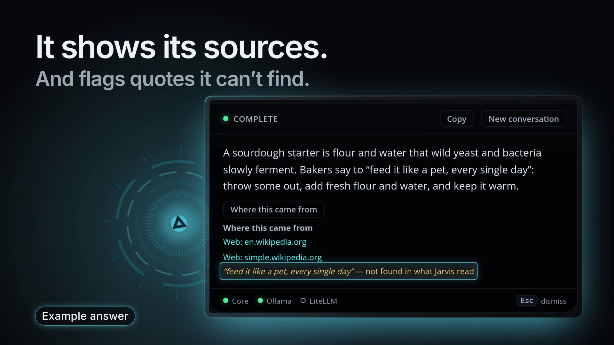

# Jarvis

A personal assistant that runs on **your own Windows PC**, with a desktop app
and an Android app to talk to it. The AI model runs on the PC's own graphics
card, so your emails, files and memories never go to a company's servers.

Version 0.2.0 ([what changed](CHANGELOG.md)). Made by darknight11ish.
Free and non-commercial: installed by hand, never sold, never on Google Play.

## Launch video

[](https://github.com/darknight11ish/Epic-Jarvis/releases/download/launch-videos/jarvis-launch-v6.mp4)

**Tap the picture to watch v6** (26 seconds, sound on; every line is on
screen). On a phone held upright, watch
[the 14-second cut](https://github.com/darknight11ish/Epic-Jarvis/releases/download/launch-videos/jarvis-launch-v6-vertical.mp4).

A real AI model on your own PC, at work: it looks things up and shows its
sources, checks it's your voice first, stops when you say stop, lets you swap
its brain from your phone, and still asks first. Every desktop screen is the
real app, with made-up examples.

The ten video files are kept in the
[**launch-videos release**](https://github.com/darknight11ish/Epic-Jarvis/releases/tag/launch-videos)
rather than in the repository: together they were 184 MB, and `videos/` was 67%
of everything here. Git also keeps a whole new copy on every re-render, so the
cost only grows. Nothing was lost - each version's plan, composition brief and
project files stay in [`videos/`](videos/), so any of them can be rendered
again:
[v1](https://github.com/darknight11ish/Epic-Jarvis/releases/download/launch-videos/jarvis-launch-v1.mp4),
[v2](https://github.com/darknight11ish/Epic-Jarvis/releases/download/launch-videos/jarvis-launch-v2.mp4),
[v3](https://github.com/darknight11ish/Epic-Jarvis/releases/download/launch-videos/jarvis-launch-v3.mp4),
[v4](https://github.com/darknight11ish/Epic-Jarvis/releases/download/launch-videos/jarvis-launch-v4.mp4),
[v5](https://github.com/darknight11ish/Epic-Jarvis/releases/download/launch-videos/jarvis-launch-v5.mp4),
[v6](https://github.com/darknight11ish/Epic-Jarvis/releases/download/launch-videos/jarvis-launch-v6.mp4).

## The five rules

1. **Private things stay on the PC.** Email, files, passwords and memories
   are only ever handled by the model on your own PC.
2. **No public tunnel.** Jarvis is reachable only over your own networks,
   never opened up to the internet.
3. **Keys are kept like passwords.** An API key is never logged, and is sent
   only to the one service it belongs to.
4. **Nothing is approved for you.** Jarvis asks, you decide - and it will
   not act while the phone's or desktop's link to the PC is out of date.
5. **Non-commercial.** Built for one owner, installed by hand.

## What it can do

**Talk and listen**
- Chat, with answers that appear as they are written.
- Voice: push-to-talk, or say "Hey Jarvis" (on the PC and the phone).
  Spoken questions get short, spoken-style answers; say "stop" to interrupt.
- A choice of manner: warm and brief, or plain.

**Remember**
- Learns facts about you from **your own words only** - never from emails,
  web pages or files - and lists every one, with Forget and "Erase the
  words". Health, money, passwords and other sensitive topics wait for your
  yes.
- Keeps your chat history on the PC, encrypted (you can turn it off).

**Keep time**
- Timers, alarms, reminders and to-do lists, by voice or typing.
- A morning briefing: today's calendar, new emails, what is coming up.
- "What did I miss?" - what went off while you were away.
- **"Tell me when ..."** an email from someone arrives, or the washing
  machine finishes. Urgent ones keep ringing on the phone until you look.
- **Focus sessions** on the PC: a timer, Quiet, and a nudge when a
  distraction comes to the front. Nothing about what you were doing is kept.

**Do things, with your OK**
- Read your email, calendar and notes, and write notes to Obsidian, Logseq
  or Joplin.
- **Send email** - one approval card per email, showing exactly who it goes
  to and every word of it.
- Search the web, with five providers to choose from.
- Control lights and devices through Home Assistant. A setting (off by
  default) lets it switch lights, plugs and fans you name without asking;
  locks, doors and alarms always ask.
- **Stop everything**: Alt+Shift+X on the PC, or the button on the phone.

**Stay in your control**
- Anything that matters waits for your approval, on the PC or the phone.
  There is no "approve all". Risky approvals need Windows Hello on the PC or
  the screen lock on the phone.
- **"What asks first"**: a page in both apps listing every action and
  whether it asks you, with switches to make it stricter.
- **Your own networks only**: the desktop app connects to Jarvis on this PC,
  your home network, Tailscale or NordVPN Meshnet; the phone connects
  through Tailscale or NordVPN Meshnet, which also work at home and keep
  the pairing key scrambled. Anything else is refused.
- A live check of the whole setup, "N pass, N fail, N warn". Run this one
  line in PowerShell from this repository's folder, with your own backend
  folder (the one holding `jarvis_hud.py`) between the first quotes; the
  result is also saved as `preflight.txt` on your Desktop:

  ```powershell
  $env:JARVIS_BACKEND = "C:\Users\pcadmin\Documents\Claude\Open jarvis files\Desktop program"; $env:PYTHONIOENCODING = "utf-8"; py -3 backend\selftest.py --preflight | Tee-Object -FilePath "$env:USERPROFILE\Desktop\preflight.txt"; Write-Host "Saved to $env:USERPROFILE\Desktop\preflight.txt"
  ```

**Look how you like**
- An animated face shows what Jarvis is doing (23 designs, three of them
  animals), with themes and
  colours that match on the PC and the phone.

## Install it

**You can install this now.** The Python program that does the work
(`jarvis_hud.py` and the 180 files beside it) is published in this repository,
in [`jarvis-backend/`](jarvis-backend/README.md), as plain source. Until
2026-10-06 it existed only on the author's PC — fifteen of its modules existed
nowhere else on Earth — so nobody else could run Jarvis at all, however
carefully they followed the install page.

Follow [`docs/INSTALL.md`](docs/INSTALL.md), in order. It has three parts:

0. **Or two commands.** From the folder you downloaded this into. First time
   on this PC:

   ```powershell
   powershell -ExecutionPolicy Bypass -File .\scripts\setup-jarvis.ps1
   ```

   It copies `jarvis-backend\` into place, runs both scripts below, checks
   Ollama and the model, installs the desktop app, starts Jarvis and runs the
   live check. It prints the 5 GB model command rather than downloading it for
   you, and `-Print` ("show me the plan, change nothing") shows each command it
   would run.

   Every time after that, one command updates **both halves** - the backend and
   the desktop app. Run it from that same folder:

   ```powershell
   powershell -ExecutionPolicy Bypass -File .\scripts\update-jarvis.ps1
   ```

   It stops Jarvis, patches the backend, installs the newer desktop app, starts
   Jarvis again and checks it. You do not have to close Jarvis first: it waits
   for you to, or closes it for you if you add `-Force` (which cuts off whatever
   Jarvis was doing at that moment). If Jarvis was running, it is started again
   for you; if it was not, it prints the one line to start it.

   Both commands are safe to run again, and both stop and say plainly what they
   did and did not change when something is wrong. The update command keeps a log
   of its own output in `_jarvis-logs` inside your backend folder, and
   `apply-patches.ps1` keeps its own log of what it changed. `-FromSource` builds
   the desktop app from this folder instead of downloading the published
   installer; `-SkipDesktop` leaves the app alone. What is still by hand is the
   phone (part 3 below) and two switches in the desktop app's own Settings: **Let
   Jarvis Desktop start and stop Jarvis**, and **Start Jarvis Desktop when
   Windows starts**.

1. **The backend on the PC** - the Python program that does the work, plus
   the model in Ollama. Copy `jarvis-backend\` to a folder of your own
   (INSTALL.md step 1.3); one script, `scripts/install-backend.ps1`, writes
   down where that folder is (one line; the live check and the test
   suites read it from then on); then `scripts/apply-patches.ps1` installs the
   Python packages, puts the settings file in place and runs the tests. On the
   published folder it changes no code, because that folder is already the
   state after the patches (INSTALL.md part 1 has both exact commands).
2. **The desktop app** - the update command above does this too: it installs the
   published installer from
   [Releases](https://github.com/darknight11ish/Epic-Jarvis/releases/tag/desktop-latest)
   when there is one (that is what the update signing key unlocks - about ten
   minutes, in [`docs/INSTALL.md`](docs/INSTALL.md), "The desktop installer, and
   the update signing key"), and builds the app from this folder when there is
   not (INSTALL.md part 2). `-FromSource` builds it from this folder either way.
3. **The phone app** - download the `.apk` from the
   [`client-latest` release](https://github.com/darknight11ish/Epic-Jarvis/releases/tag/client-latest)
   and open it on the phone, or run `adb install -r <file>.apk` from the PC.
   Then pair it with the PC (INSTALL.md part 3).

Install only `jarvis-client`, from that release. The `jarvis-android` folder
is an older app kept for reference: it speaks a connection method the
backend never had, so it cannot talk to Jarvis at all. It no longer
publishes a download, so the two cannot be mixed up - installing the wrong
one would look like "my phone is broken" rather than "wrong app".

**What is still unproven, said plainly:** nobody has yet taken a fresh clone on
a clean PC through all three parts and started Jarvis. The patch step has been
measured against the published folder - it exits 0 and changes no code - and
the other steps are the ones INSTALL.md already described. If you are the first
to try it, the page is the place to report what it got wrong.

## Where things are

| Folder | What is in it |
|---|---|
| `jarvis-desktop/` | The Windows app (Tauri). Rust in `src-tauri/`, the windows in `src/`. |
| `jarvis-client/` | The Android app. |
| `jarvis-backend/` | **The backend itself**, as plain source: a checked copy of the author's, 181 files. [`jarvis-backend/README.md`](jarvis-backend/README.md) says where it came from and what it is not. |
| `backend/` | Changes (patches) for the backend, the modules it needs, and a test for each. The patches are written against the author's own backend folder. [`backend/README.md`](backend/README.md) has the table. |
| `docs/` | How it all works. [`docs/README.md`](docs/README.md) says which documents are current. |
| `scripts/`, `tools/` | The patch script, and tools that generate test data and notices. |
| `keystore/` | How the phone app's signing key is restored on GitHub's build machines. The key itself is never committed. |
| `jarvis-android/` | The older phone app, kept as source only. |
| `server/` | An old server, not used by Jarvis (its README says so). |

The documents to read first: [`docs/ARCHITECTURE.md`](docs/ARCHITECTURE.md)
(how the pieces fit, and the rules), [`docs/INSTALL.md`](docs/INSTALL.md),
[`docs/JARVIS-API.md`](docs/JARVIS-API.md) (what the apps ask the PC), and
[`backend/README.md`](backend/README.md) (what each backend change fixes).

## How it is built

- **Phone app:** GitHub builds it. A build is published to `client-latest`
  only after an Android emulator has installed and started that exact file,
  and only from `main`.
- **Desktop app:** built on Windows with `npm install` and `npm run tauri build`
  in `jarvis-desktop/`; GitHub also builds the installer.
- **Every change** runs the tests on GitHub: the backend suites, every
  desktop page test, the Rust checks, and PowerShell 5.1 running the patch
  script.

## Licence

Jarvis is MIT-licensed ([`LICENSE`](LICENSE)). It is built with parts made by
other people that keep their own licences, including wake-word models that
are for non-commercial use only: see
[`THIRD-PARTY-NOTICES.txt`](THIRD-PARTY-NOTICES.txt), and in the phone app,
FAQ -> About -> Third-party notices.
