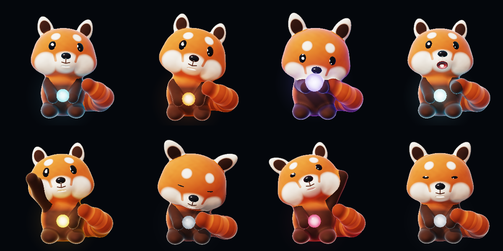
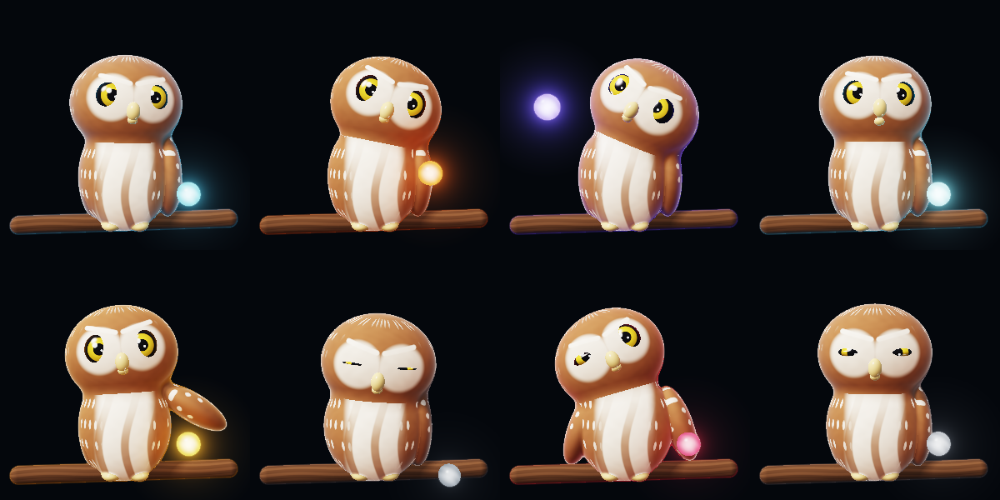
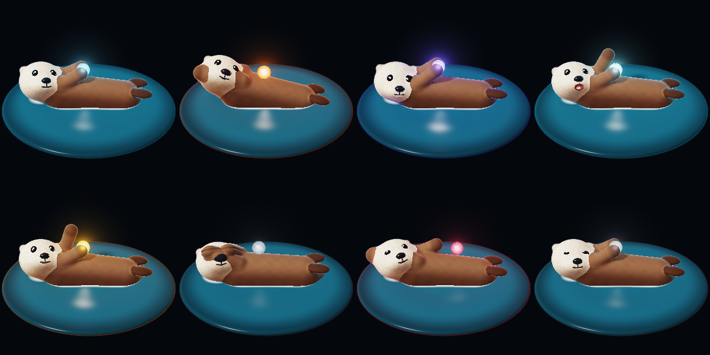
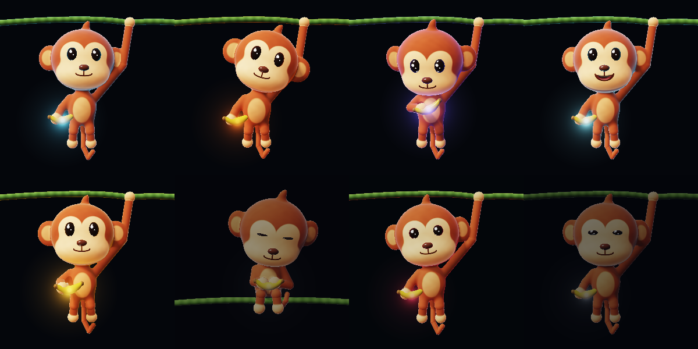
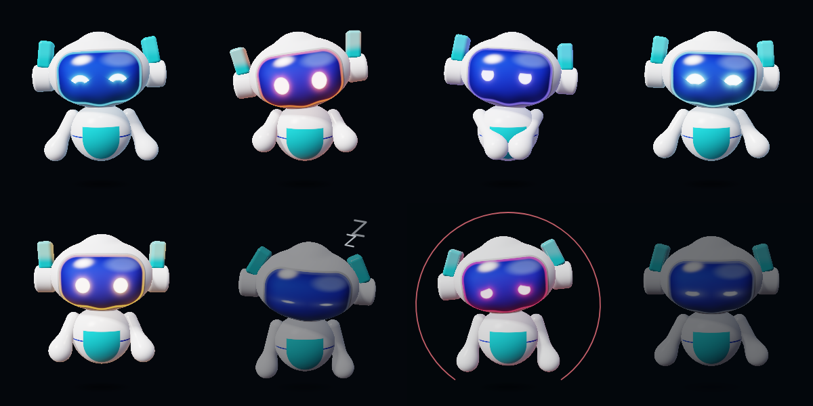

# Animal faces ("critters")

Jarvis had twenty faces: animated pictures that show what it is doing, all
of them instruments - rings, orbits, a drum skin. Now it also has **four
animals**, small cartoon characters that sleep, listen, think and talk: a
**red panda**, a **pygmy owl**, a **sea otter** and a **monkey** - and a
**robot**, a small floating helper made the same way.

The owner's choice, 2026-09-27: all three animals Gemini suggested, panda
first; the owl and the otter once the panda worked (go-ahead given the same
day). The monkey followed on 2026-09-28, from the owner's own picture, and
the robot the same day, from another of the owner's pictures. **The robot
counts as an animal everywhere**: every animal option, rule and switch in
this file covers it too, unless its own section says otherwise.

## How to switch to one

- **Desktop:** open the Faces window, click the Red Panda, Pygmy Owl, Sea
  Otter, Monkey or Robot card, then choose it as Jarvis's face - the same as picking any
  other face. The widget, the floating face and the HUD all show whatever
  face is chosen there.
- **Phone:** Appearance, then pick the animal from the faces.
- The choice is shared through the backend like any other face, **once
  your PC has the updated `jarvis-visual-spec.json`** (see "One thing to
  check on the PC" below).

## The four animals and the robot

In each picture, top row: idle, listening, thinking, speaking. Bottom row:
waiting on you (approval), asleep (standby), confused (error), dozing
(banked). Rendered by the shaders and pose code (redrawn 2026-09-29). The orb
and rim colours are the default colours for each state; the owner's own
colour choices replace them. The error picture also shows the still error
ring, and the asleep one its Zs - both drawn by the apps over the face, not
by the shader (see "Two still rings" below).

### Red panda



| Jarvis is... | The panda... |
|---|---|
| Idle | Sits holding its orb in its lap. Looks at one thing, then another - its eyes move first and its head follows - and holds each look for a few seconds. Its weight shifts now and then; its tail swishes slowly, the swing running out to the tip. About every 20 seconds it does one small thing - most often a flick of its tail or an ear turning toward a sound before its head does; now and then a stretch (leaning back, paws out) or a scratch. |
| Listening | Perks both ears up, tilts its head about 15 degrees and leans in, its eyes on you. Your voice lifts its ears a little and makes the orb glow brighter. |
| Thinking | Lifts the orb up in both paws and gazes into it, glancing up and away now and then. The orb glows its brightest. |
| Speaking | Its mouth makes the shapes of the words it is saying (see "How the mouths talk" below). It leans in and talks with its eyes and, now and then, a nod, a paw lifted off the orb, or a tilt of the head - never two alike in a row, and never just as its eyes move to look somewhere. |
| Waiting on you | Sits up, leans in and looks straight at you, ears up, holding its orb up higher - and keeps still but for its breathing, slow blinks and its eyes' tiny movements. No wave: the question may be a serious one. |
| Asleep | Eyes shut, head drooped, ears down, tail wrapped round, breathing slowly; now and then a sigh. Nothing else moves. The orb dims to an ember. |
| Something went wrong | A still, concerned look: head tipped a little and lowered, eyes down, brows drawn, ears back a touch. |
| Keeping things for later | Dozing with half-closed eyes, blinking slowly; now and then its head sinks and it catches itself. |

### Pygmy owl



A round owl on a branch, with huge yellow eyes. Owls have no hands, so its
orb floats beside it. Its cream chest fades into the brown of its neck and
shoulders over the top fifth of the body, instead of ending in a straight
hem (2026-09-29; +8 shader size; only the chest's band of colour changed).

| Jarvis is... | The owl... |
|---|---|
| Idle | Its head does the looking: it turns to something and holds still there, the way owls do (up to about 20 degrees either way). Its weight shifts on the branch now and then. About every 20 seconds: most often a curious tilt of the head or a long slow blink; now and then a ruffle of its feathers or a wing lifted and folded back. |
| Listening | Tilts its head right over and opens its eyes wide, looking at you, its brows level. The orb comes close. |
| Thinking | The orb comes up its right-hand side, then circles its head - riding high over its brow in front, so it never crosses its eyes - and the owl tips its head a little and turns to follow it. Leaving, the orb goes round the side (or round the back), never across the face. |
| Speaking | Its beak opens with the words it is saying, showing the dark inside. Its eyes lead each look, the head following a little; now and then a nod, a small lift of a wing, a tilt - never two alike in a row. |
| Waiting on you | Draws itself up - sleek feathers, head a little higher - leans in and looks straight at you, eyes a little wide and brows level, still. No wave. |
| Asleep | Fluffs up round, sinks its head in, eyes shut to slits; now and then a sigh. The orb settles on the branch, dim. |
| Something went wrong | A still, concerned look: head tipped a little and lowered, eyes down, the V of its brows flattened (in this owl's drawing a raised brow steepens the V into a glare, so a lowered one reads as worried). |
| Keeping things for later | Fluffed and half-lidded, blinking slowly; now and then its head sinks and it catches itself. |

### Sea otter



An otter floating on its back in a small round pool, a glowing pebble - its
orb - on its chest. Rings spread across the water as it bobs.

**More detail (the owner, 2026-09-28: "the otter looks too plain ... the
water around the otter is too plain as well").** All of it is painted on
in its colours, once a pixel, not built into its shape - so it cost almost
nothing of the phone's size limit (below):

- *Fur.* Soft wavy strands in short tufts along the body and arms, with
  finer hairs inside each tuft when the picture is big enough to hold them;
  on the face the fur fans out from the nose. The strands show more at the
  outline, so its edge reads soft and furry rather than smooth. A dark
  back, a lighter belly and a pale chest under the chin; darker paws and
  feet, with faint toe creases. Three staggered rows of whisker dots on
  each side of the muzzle (the mouth is drawn over them).
- *Water.* Small wavelets crossing each other, shading the water and
  catching the light in soft broken glints; rings spreading out from the
  otter, stronger while its feet paddle; a thin, broken line of foam where
  it meets the water; lighter water close in, deepening to near-dark at the
  pool's edge, so the edge melts into the background instead of looking
  like a plastic ring. Everything moves slowly - a wavelet travels about
  its own length in two to three seconds - and asleep it is half as strong.
  It all runs off the water's own clock from the pose (`uWater.y`, one
  turn every 2.6 seconds), in whole turns, so nothing jumps when that
  clock wraps round; the shared `uTime` was not used, because it speeds
  up, slows and even reverses with the state, and wraps differently on
  the two apps.
- *Never sparkling when small.* Each pattern fades out as the picture gets
  too small to hold it (it uses `uPx`, the size of a pixel): at 96 px the
  otter looks almost as it did before, smooth; the tufts come in from
  about 85 px (full by about 235), the whisker dots from about 160 (full
  by about 450) and the fine hairs from about 210 (full by about 580).
- *Calm, serious and still quieten it too.* The pose scales the ripple
  strength it sends (`uWater.z`) by the same option weights as the
  otter's rocking: calm halves the waves and rings, serious takes 60
  percent off, and "Keep the animal still" stops them altogether (a still,
  flat pool). Only the options - each state already sets its own strength
  (asleep is half).

| Jarvis is... | The otter... |
|---|---|
| Idle | Floats and rocks gently with the water and looks about. About every 20 seconds it does one small thing: most often rubs its pebble, kicks its feet or rolls a little to one side; now and then washes its face (its pebble resting on its chest meanwhile). |
| Listening | Lifts and tilts its head, its pebble held in its paws. |
| Thinking | Taps the pebble on its belly in little bursts, watching it, and glances up now and then. |
| Speaking | Its mouth makes the shapes of the words it is saying. It keeps its pebble low on its chest and talks with its head - a nod, both paws lifting a little, a tilt. (Waiting on you holds the pebble up instead, so the two are easy to tell apart.) |
| Waiting on you | Lifts its head and holds its pebble up a little off its chest in both paws, toward you, forearms along its chest (held higher, the arm stood up and read as a raised hand), looking at you - still, floating more quietly. No wave. |
| Asleep | Covers its eyes with its paws, its pebble resting on its chest, and drifts, rocking less than when awake; now and then a sigh. |
| Something went wrong | A still, concerned look: head tipped a little, eyes lowered, holding its pebble. |
| Keeping things for later | Dozing with half-closed eyes, blinking slowly; now and then its head sinks and it catches itself. |

### Monkey



The owner's fourth animal (2026-09-28), from their own picture of a cartoon
monkey, in the same style as the other three: warm brown fur, a big peach
face shaped like a heart - a round patch round each eye over a wide one
across the cheeks and muzzle - big round ears with peach insides, a small
tuft on top, a peach belly, long arms and legs with peach hands and feet,
and a long thin tail ending in a curl. It hangs by one arm from a green vine
across the top of the picture - the arm rises from its shoulder beside its
head, bent a little at the elbow, and passes behind the edge of its ear, as
in the picture - and swings gently round its hand, like a slow pendulum. **Its banana is its orb**: the banana's ends stay banana-yellow,
its middle glows in the state's colour with the same halo the other orbs
have, and it lights the monkey the same way. The owner asked for it to be
"more energetic than the other animal models to a degree", so it is a
little livelier - see "How they move" for the numbers - but smooth, and
the serious moments are as still as the others'. The owner then set how
much: **about 1.5 times the panda's resting movement** (2026-09-28).
Measured with the comfort review's harness over half an hour of idle, the
middle of its head travels at most 6.6 percent of the animal's height
(the panda's, 4.5: 1.47 times); the swing itself is about 1 degree each
way, 1.4 at its widest.

| Jarvis is... | The monkey... |
|---|---|
| Idle | Hangs and swings gently (one swing every 3.5 seconds, about 1 degree each way), its legs and tail trailing the swing a moment behind. Looks at one thing, then another, a little more often than the others, with a curious tilt of its head. About every 19 seconds it does one small thing - most often kicks its legs, turns to something with one ear first, or curls its tail tip; now and then looks at its banana (lifts it, tips its head, turns it) or swings a little wider for a few swings; once in a while scratches the top of its head. |
| Listening | Leans in, its head tilted about 15 degrees, its ears turned forward to you, its eyes on you; its swing settles to about half. |
| Thinking | Brings its banana up in front of its chest and looks into it - it glows its brightest - tapping it in little bursts, glancing up and away now and then. |
| Speaking | Its mouth makes the shapes of the words it is saying. It talks with its eyes and, now and then, a nod, its banana lifted a little, or a tilt of the head - never two alike in a row, and never just as its eyes move. |
| Waiting on you | Hangs still, leans in and looks straight at you, ears forward, its banana held out a little toward you. No wave. |
| Asleep | Has climbed up and sits on the vine, its legs hanging in front, its tail curled round the vine, hugging its banana, head drooped, eyes shut, breathing slowly; now and then a sigh. |
| Something went wrong | A still, concerned look: head tipped a little and lowered, eyes down, brows drawn, ears back a touch; it hangs almost still. |
| Keeping things for later | Dozes where it hangs, half-lidded, swinging a little; now and then its head sinks and it catches itself. |

Because it sleeps sitting ON the vine and hangs from it awake, going to
sleep it climbs up, and waking it slides back down. The picture follows the
monkey, so on screen it is the vine that moves - down past the monkey as it
climbs, and **always behind it**, so it never cuts through the monkey. That
move is not an extra: it is the difference between its two poses, so it
happens under calm, still and serious too (plainly, without the extras
below).

### Robot



The owner's fifth face (2026-09-28), from their own picture of a cute robot,
in the same soft 3D style as the animals: a big rounded white helmet of a
head with a raised ridge along the top, a large glossy dark-blue visor with
a glowing rim, a round ear pod each side with a teal fin on top (the left
pod has a dark round port), a small egg of a body with a teal shield on its
chest and a thin blue line round its waist, and two rounded mitten arms. No
legs: it floats, and a soft shadow on the ground below follows it, fainter
and wider the higher it goes.

**No mouth and no orb.** Its eyes, glowing on the visor, are its face. They
glow in the colour bound to the state - the colour the animals' orbs glow
in - with only a small white middle, and so does the visor's rim. (Until
2026-09-29 the white was most of it: the glow was laid over the blue glass
and squeezed by the shader's tone curve, so every state's eyes came out
near-white - saturation 0.02 to 0.07 - and listening and waiting on you were
the same pale pink. Now the glass is nearly black under each eye, so its blue
no longer mixes in, and the eye is the state's colour. Measured on the eyes'
brightest pixels, 300 px: saturation idle 0.04 to 0.55, listening 0.03 to
0.39, thinking 0.07 to 0.50, approval 0.04 to 0.46, error 0.06 to 0.33;
listening amber and waiting on you yellow are now 20 levels of 255 apart in
their eyes' average colour where they were 9. The picture
`critters/robot-states.png` above was redrawn with this, as the Faces window
draws it, so it now also shows the Zs asleep and the waiting-on-you ring.) The common
shader's orb is kept only as a light, a point just behind the glass: it
throws no glint and no halo, but lights the robot's chest, mittens and fins
in the eyes' colour, as the animals' orbs light their fur. **While Jarvis
speaks, the eyes pulse with the real voice** - a touch brighter, a touch
bigger and a small hop on each opening - taken from the same mouth track the
animals' mouths follow (docs/LIPSYNC.md), scaled by how much it is
speaking. No real voice (a typed answer, Quiet, an answer kept on screen):
no pulse, exactly as a mouth stays shut.

| Jarvis is... | The robot... |
|---|---|
| Idle | Hovers, bobbing gently (once every 3.4 seconds, about 2 percent of its height), happy arcs for eyes, looking about - the eyes first, the head after - its fins swaying a little. About every 20 seconds one small thing: a fin flicks, then the other; a curious look to one side with round eyes; a small dip and rise with a blink; it lifts its left mitten, looks at it and wiggles it; a happy squint. Now and then it zips round its space, and its two cute moments take turns (below). |
| Listening | Wide, round eyes on you, its fins leaning in, its mittens up and open ("go on"), its head tilted; your voice makes its eyes and fins glow brighter. |
| Thinking | Narrowed eyes looking up, scanning slowly from side to side, their glow swelling and ebbing; a mitten to its "chin". |
| Speaking | Bright, slightly happy eyes that pulse with the voice; it talks with its head and its mittens in phrases - a nod, one mitten opening out palm up, the other, both, a tilt with a fin flick - never the same twice running. |
| Waiting on you | Steady round eyes, a touch wide, straight at you, fins up, mittens a little forward, leaning in; it hovers almost still. No wave. |
| Asleep | Powered down: its eyes a dim line, head bowed, fins drooping, mittens slack; it floats a little lower and slower; now and then a sigh. |
| Something went wrong | A still, concerned look: eyes a little smaller and slanted (inner ends up), looking down, head tipped, fins drooping, mittens lowered. |
| Keeping things for later | Dozing where it floats, lids heavy, blinking slowly; now and then its head sinks and it catches itself. |

**Its zip.** About once every two minutes at rest (in three of the sixteen
16-second slots of every 256 seconds, each with a chance of 0.75; measured
over an hour at rest, 27 zips) it zips round inside its own space: a quick dash out to a spot a
little to one side and back into the picture (so it gets smaller as it
goes), a little loop there, and back to its resting place - about 2.6
seconds, banking into each turn, its eyes looking where it goes. Every part
eases in and out, so it never changes speed in a frame (measured at 240
frames a second), and it never leaves its frame (measured over half an
hour: the nearest it comes to the edge is 0.99 of the way there, counting
its mitten and pod edges generously; at most about 3.4 of its own units a
second). Never across the screen; never under "Keep the animal still", calm
motion or a serious moment, in a focus session, while it is being petted
(it comes back to the hand), or in any state but idle; only once it has
rested 10 seconds, and never while one of its cute moments plays.

**Its two cute moments** (the owner's "two cute idle moments", the shared
timing every face uses): a **friendly wave** - its right mitten up as in the
owner's picture, waving side to side, eyes smiling, head tipped - and
**polishing its visor** - a mitten comes up and rubs two small circles on
the glass, eyes squeezed happily shut, then a gleam crosses the visor and
its fins flick.

**Powering down and booting up** (its own nodding off and waking). Nodding
off (3 s): its eyes keep their shape as they narrow to a line and their
glow dims; it sinks a little as its hover slows; its fins, mittens and head
hold a moment and then droop. Waking (2.2 s): the dim line of its eyes
brightens first, then they open, blink once, and its fins flick up; a small
lift as it powers up. Waking into waiting on you, an error or a doze, or
under calm, Still or a serious moment: only the eyes.

**Hello and goodbye** (switching faces): goodbye is a quick wave with happy
eyes, then it zips up and out of the top of the picture; hello, it drops in
from above, settles with a small bounce, its eyes boot up, blink and look
at you. Under Still, calm or a serious moment - or while waiting on you or
at an error - it plays none of it, like the animals, and the host
cross-fades (`CritterPose.switchAlpha`). Asleep or dozing it drops in without
the fin flick. Same inputs
as every animal (`goodbye`, `hello`, 0..1, over `GOODBYE_S` / `HELLO_S`, 1 s
each - see "What a host passes" below).

**Everything the animals have, it has.** All eight states; the calm,
serious and Still weights; every new behaviour below (listening nods,
gestures on sentence ends, the focus buddy, the fact-saved nod, the
long-answer glow, petting, the two cute moments, hello and goodbye, and
variety in every kind of move), with the same inputs and the same rules;
the Zs (rising from beside its head); the hollow ring and no Zs when Jarvis
is not connected; the dimming on standby and banked; the sky behind it; the
sharpness and frame-rate settings; the GPU watchdog and a flat drawing when
the graphics card cannot keep up (a flat robot in the same pose, its eyes
in the state's colour); and its own voice under "Voice follows the face"
(below). What is its own:

- **No mouth, so its eyes pulse** with the voice (above). The long answer's
  glow, which lights an animal's orb, **brightens its eyes and fins once**
  instead.
- **Its soft shadow.** The only face that floats clear of anything, so it
  is the only one with a shadow on the ground: common_tail.sksl asks every
  face's `ground(ro, rd)` how dark the ground is where a ray misses; the
  robot's answers, the animals' say 0 (five bytes of shader each).
- **Its resting moments** are the zip and five small happenings (a fin
  flick, a curious look, a dip and rise, a look at its mitten, a happy
  squint) - its idle variety, as the animals' happenings are theirs.
- **Variety** (the owner's "variety, never over the top"): listening
  (the other tilt, leaning closer with both fins forward, one fin turned to
  you), thinking (its mittens tapping together at its chest, a tilt with a
  fin twitching, a look down), talking (five gestures, three of them its
  mittens), and a small reaction as "waiting on you" arrives (a small lift
  with its fins up, its eyes widening a touch with a blink, a lean in) or
  "something went wrong" does (a small start back with a blink, its fins
  drooping with a blink, a glance down) - then still.
- **Its voice:** Emma (Kokoro's British voice, which no animal uses), two
  steps higher and "Faster" - energetic and bright. Chosen by measuring
  six candidates made with the real Kokoro model, not by ear: the same two
  sentences take 6.6 s instead of her plain 7.6 s, her middle pitch goes
  from about 185 to 205 Hz and moves over a slightly wider range. The
  owner can change it like any animal's, in "Each animal's voice".

Measured on the desktop's pose code (the same harness as the table in "New
behaviours"; a still robot at the same moment as the reference): listening
nods, head at most 4 deg, 13 deg/s; listening variety 24 deg, 30 deg/s;
talking on phrase ends 7 deg, 18 deg/s; a focus session, head speed at most
3 deg/s; petting, body tip 2.3 deg, top travel 1.4 %; its cute moments,
head 16 deg, 58 deg/s at the fastest (the visor polish). A zip moves it
much further - up to 63 % of its height and 11 deg of bank - on purpose,
eased, and inside its frame.

Rendered: `docs/critters/robot-states.png` (eight states, the default
colours).

### What all five share

In the desktop's Faces window each animal also turns to follow the mouse
pointer for a few seconds after it moves over the face (the widget, HUD and
floating face have no pointer, so there it does not). Dragging turns the
camera round it, as for every 3D face.

A change of state no longer moves every part together. The eyes get there
first (about a tenth of a second), then the mouth and the head, then the
paws and the body (about half a second), and the loose parts - tail, ears,
wings - last, swinging a few percent past and settling back. The new
state's own movement starts at once; what settles is only the difference
from what was on screen, and it keeps whatever speed the old pose had, so
nothing jumps or suddenly changes speed. A change arriving mid-settle
carries on from the half-finished pose - even a quick change back
(speaking, something else, speaking again), and three or four changes in a
row: each app hands the pose its list of recent changes (up to six), and
the pose works back through them. Falling asleep and waking are not a plain
settle: each animal plays a short piece of its own (see "Waking up and
nodding off" below); dozing off and rousing from a doze take about twice
the usual time.

### Two still rings, a focus session, and what a screen reader is told (owner, 2026-09-29)

**The two rings.** Both are drawn by the apps over the face - not in the
shader - outside the face's own shake and flinch, and neither ever moves,
pulses or fades, so both are fine under Still, calm motion and a serious
moment. They are told apart by **shape**, not by colour alone:

| | Not connected | Error |
|---|---|---|
| Shape | a complete circle | an arc with a gap of 70 degrees centred at the bottom (six o'clock) |
| Weight | the heavier: at least 2.5 px on screen, 0.012 of the picture | thin: at least 1.5 px on screen, 0.006 of the picture |
| Colour | the standby colour | the error colour |
| Which faces | every face | the four animals and the robot |
| Radius | 1.03 of the overlay radius (0.4532 of the picture) - the same for both | |

Neither is the waiting-on-you clock: that one is drawn inside them (0.95 of
the overlay radius), starts at twelve o'clock, sweeps round, and once closed
is a full circle with a faint track - and a face never shows it while it is
not connected. An error never shows while not connected either (that face is
standby).

**The colour rule.** The not-connected ring used to be dimmed by standby's
0.6 and measured **1.65 : 1** against the ground, so "cannot hear me" and
"asleep" looked alike from across a room. Both rings now take the colour
bound to their state, fixed (never the pattern's colour of the moment) and
made readable against the ground they sit on: left alone if it already
measures 3.2 to 5.5 : 1 (WCAG), otherwise moved toward white or black (too
faint, to about 4 : 1) or back toward the ground (too loud, to about 5 : 1).
On the desktop's dark ground the not-connected ring is now 4.0 : 1 and the
error ring 5.0 : 1; on a light ground the same rule darkens them. The one
rule is `ringTone` in `faces.html` and `FaceRings.tone` on the phone, held to
the same answers by `jarvis-desktop/tests/fixtures/ring-cases.json`. The
tray icon needed no change: its hollow ring has a two-tone outline that
stands out on any taskbar (a new test in `tray.rs` proves it) - and an error
on the tray is still its red disc, since the tray is not a face.

**A focus session shows the focus buddy, not a sleeping animal.** A focus
session puts Jarvis on Quiet, and Quiet reads as asleep - but the focus
buddy only plays on an idle face, so the animal used to sleep, wake to say
"YouTube can wait", and doze off again. The PC records why it is Quiet
(`why` in `capabilities.power`: "the focus session" for a focus session,
"the owner, from ..." for a hand-set one). The desktop turns that into
`power_set_by = "focus"` (`stream.rs`), and the resting face is then idle,
not standby, on every surface: the faces (`restingAsleep` in
`jarvis-link.js`, `specState` in `faces.html`), the HUD, and the tray icon
(`tray.rs spec_state`, so the two agree; its menu row says "Power: quiet ·
focus session"). The phone reads the same `why` from the handshake and again
on every `power` event (`RestingFace` in `FaceShellRules.kt`). A Quiet the
owner sets by hand replaces the reason and stays asleep, and so does standby
of any kind. A `power` event is now read together with `/api/version`, so
the mode and its reason reach the faces together and the animal does not
nod off for a moment first. *Known limit:* if the owner presses Quiet while
a focus session's Quiet is already on, the mode does not change, so no
`power` event is sent and the face keeps the focus buddy until the next
change.

**What a screen reader is told.** The desktop now says the phone's plain
sentences - the floating face and the widget in a live region, the face page
on its own as the picture's label (`face-words.js`; the phone's `FaceWords`):

| State | Said |
|---|---|
| Error | Jarvis has a problem |
| Waiting on you | Jarvis is waiting for your decision |
| Listening | Jarvis is listening |
| Thinking | Jarvis is working |
| Speaking | Jarvis is speaking |
| Banked | Jarvis has notes saved for later |
| Asleep | Jarvis is on standby and will not speak |
| Idle | Jarvis is idle |
| Not connected (any pose) | Jarvis isn't connected |
| Focus session (resting) | Jarvis is working beside you in your focus session and will not speak, except to name a distraction |

`jarvis-desktop/tests/fixtures/face-words.json` holds both apps to this one
list. (The focus sentence keeps "will not speak" true: a focus session is on
Quiet, and the one thing it does say aloud is the short line naming a
distraction.)

**The widget's round window.** The widget shows the face in a 120 px circle,
which cut off the panda's and monkey's Zs (they reached up to 1.3 times the
circle's radius). The widget asks for the circle (`&clip=circle`), and the
Zs overlay pulls each z toward the centre until the whole letter is inside
0.94 of it - position only; nothing else changes and no other window is
touched.

**The pictures above** were redrawn on 2026-09-29 from the current shaders
and pose code: the red panda's and pygmy owl's still showed a wave at
"waiting on you" and a raised paw or wing at "error", which the 2026-09-28
decision removed. They now also show what the apps draw over the face: the
error ring on the error picture and the Zs on the asleep one.

### How they move

The owner asked for the animals to move their bodies, calmly: an assistant
on a desk, not a busy mascot. What they do, and the limits they keep to:

- **Looking.** Each animal looks at something - often you - and holds that
  look for about 1.5 to 6 seconds before its eyes jump to something else.
  The head follows the eyes a moment later and turns only part of the way.
  Between looks the eyes make the odd tiny jump of their own. A look is
  always held at least 0.6 seconds. Blinks come every few seconds (about 12
  to 15 a minute), now and then a double blink, and a blink as the head
  swings far round. Each animal has its own timing, so side by side they do
  not blink or glance together.
- **Weight and sway.** The body settles into a new lean every few seconds
  and holds it - at most about 1.5 degrees (the otter's water rocks it up
  to about 3). The panda's tail swishes and
  the swing runs out along it to the tip; its ears swing a little behind
  the head when it turns.
- **Small happenings.** (Since 2026-09-29, when the owner has not used
  Jarvis for five minutes, only about one in four of these plays - see
  "Motion that does not repeat" below.) When idle, about every 20 seconds
  (never closer than 10) one animal does one small thing - listed in the tables above -
  easing in and settling out. The small ones (an ear, a tail flick, a
  tilt, a blink) come up most; the big ones (a stretch, a scratch, a ruffle,
  a face wash) about one time in eight each, and never the same thing twice
  in a row. Long quiet stretches are normal.
- **Talking.** While speaking, each leans in a little; its eyes lead each
  look and its head follows only a little (a twelfth of the look; the
  owl's, an eighth). It gestures in phrase-sized pieces: at most one nod,
  paw or wing lift, or tilt every two seconds, often none, never the same
  one twice running, and never within a second and a half of its eyes
  moving to look somewhere - so a gesture and a head turn never pile up.
  Measured: about 7 gestures a minute, one gesture-or-head-turn every 4 to
  5 seconds on average, and 1 to 2 percent of them less than 1.5 seconds
  after the one before. Nods are about 3 degrees.
- **The pointer** (the desktop's Faces window) is followed mostly with the
  eyes; the head turns only a little toward it, and the pointer's position
  is smoothed over a quarter of a second, so a quick sweep no longer swings
  the head round.
- **Asleep** only the breathing moves (and a rare sigh); **dozing**, the
  head sinks slowly and catches itself now and then.
- **Waking up and nodding off** (the owner, 2026-09-28). When Jarvis
  leaves standby - by the schedule, by hand, or when the link comes back
  after "not connected", which shows standby too - the animal wakes up in
  about two seconds; when it goes to standby it nods off in about three.
  Calm, never busy, and **the mouth never moves** (it follows Jarvis's real
  voice and nothing else, so no yawn):

  | | Waking up (about 2 s) | Nodding off (about 3 s) |
  |---|---|---|
  | Red panda | Its eyes open with a slow double blink; its head lifts a little past and settles; a small stretch (leans back, paws up and out, chin up, a deeper breath); its ears perk with a flick. | Heavy eyes and a slow blink; its head nods as it drifts, it catches itself (eyes open a little, ears up), another heavy blink - then its head goes down and its tail curls round. |
  | Pygmy owl | One eye opens, then the other; a quick ruffle of its feathers with a small shiver; its head draws up a little and settles with a small shake. | Its eyes half close, one last slow blink, then it fluffs up round (a touch past, and settles) and tucks its head in. |
  | Sea otter | Its paws stay over its eyes a moment and rub them; then they come away into a small stretch in the water (paws up and apart, chin up, toes out) and go back to the pebble, picking it up. | A slow stretch in the water, then its paws come up over its eyes, leaving the pebble on its chest, and it settles. |
  | Monkey | It takes hold of the vine and slides down off it to hang by one hand again (the vine going back up, behind it); as it hangs, its eyes open, it has a small stretch (legs out, a deeper breath) and its ears flick. | It looks up at the vine and climbs up it, the vine passing down behind it; its hand keeps hold until the vine is down at its middle, then it lifts its legs over, curls its tail round the vine, hugs its banana, and its head droops. |

  - **Waking straight into "waiting on you", "something went wrong" or a
    doze**, only the eyes open, gently - no stretch, rub or ruffle - so
    those looks stay attentive and still.
  - **Calm, serious and still:** only the eyes open, or close, slowly.
    (Each is a weight, so part way on gives part of the piece.)
  - **Nothing doubles up.** While it wakes, its idle happenings, talking
    gestures and ordinary blinks wait, then come back over the last
    moments. Woken by a question and answering straight away, it plays the
    whole wake-up while it speaks: the mouth follows the voice as always,
    only the gestures wait.
  - **A quick flip never snaps.** Asleep for a moment and awake again (or
    the other way round): each piece is scaled by how far the one before it
    had got, and carries on from what was on screen. Woken into listening
    and then thinking, the wake-up carries on across both changes rather
    than starting again.
  - **The Zs** fade out in the first 0.3 to 0.7 seconds of waking, and
    only rise once it is asleep - from about two seconds into nodding off,
    all of them by three - not the moment standby starts.
  - Both apps play the same piece: it is part of the pose code
    (`wakeSleep` in each animal's `critter-*.js`, the same in
    `CritterPose.kt`, `OwlPose.kt` and `OtterPose.kt`), a pure function of
    the state, the list of past changes and the clock, held equal by the
    fixture like everything else. Measured at 240 frames a second: no
    sudden change of speed where either piece starts or ends; the head
    turns at most about 35 to 50 degrees a second (as it did before); the
    otter's paws are the fastest thing, about half the picture's width a
    second as they leave its face.
- **Serious moments stay serious** (the owner's call, 2026-09-28).
  **Waiting on you** can be a risky decision - an email about to be sent -
  so there is no wave and nothing cute: an attentive look straight at you,
  held still. **Something went wrong** is a still, concerned look, with no
  head-scratching and nothing comic. Only breathing, slow blinks and the
  eyes' tiny movements (a few hundredths of the eye's reach, always at
  you) move - enough to read as alive, not frozen.

**Moving less: calm, serious and still.** Each pose takes three more
inputs, each a weight from 0 (off) to 1 (on). The apps ease each one over
about a second when it switches, so the animal never snaps into or out of
them; the mouth is untouched by all three.

- **Calm** - the desktop's "reduce motion" (the operating system's
  setting) and the phone's calm motion. The head takes less of each look
  (about 40 percent), the idle happenings and talking gestures stop, and
  the slow rhythmic movements - the head's wander, the weight shifts, the
  tail's swish, the otter's water, the owl's orb circle and tilt while it
  thinks - are smaller. Blinks and sighs stay. On the desktop an animal
  under reduced motion is still drawn 30 times a second (other faces drop
  to 10): its movements are already calmer, and at 10 they stepped.
- **Serious** - a crisis moment (the `wellbeing` event, docs/JARVIS-API.md
  section 38.1; the owner's words: "calm and plain"). A calm, attentive
  listener: no happenings, no gestures, no tilts (listening's tilt too), no
  wide playful eyes; slower, steadier looks, mostly at you; blinking and
  breathing. The apps end it themselves 900 seconds after the last "true"
  if no "false" arrives.
- **Still** - the owner's "Still" option, **"Keep the animal still"**, off
  unless chosen: on the PC in Settings -> Appearance -> "Face on this
  computer" (saved on that computer only, `jarvis.faceTuning` in its
  storage, and read by every face on it - the widget, the floating face, the
  HUD and the Faces window), on the phone in Appearance -> More options,
  under Motion (saved on the phone, `Look.stillAnimal`). No card: it only
  takes movement away. It sits calmly and only breathes and blinks: no
  looks led by the head, no gestures, no happenings, its eyes resting on
  you with only tiny darts. The owl's thinking orb still circles, in a
  small ring above its head, so thinking still reads as thinking. The other
  faces ignore it, and both switches say so.

**When more than one is on.** They are three weights on the same pose, not
three modes, so they combine rather than fight: each takes movement away
and none adds any. Serious takes away the most (no tilts, no wide eyes);
still takes away the looking around; calm makes what is left smaller. The
mouth follows the voice under all three. The Zs (below) are not movement of
the animal: Still keeps them; calm turns them into one still z; serious does
not change them (a crisis answer and standby do not happen together).

**The sleeping "Zs"** (the owner's call, 2026-09-28). While an animal sleeps
on standby - whether the schedule or you put it there - small letter z's
rise from beside its head: a new one about every 1.4 to 1.8 seconds, each
living 3.2 to 4 seconds, so two or three at a time. Each fades in, rises up
and a little outward (away from the head), sways gently, grows a little and
fades out. Where the head is high (the panda's) they go up and out on a
slant rather than into the top edge. They are in the colour bound to
standby (the neutral grey unless you chose another), lightened toward white
so they read on the dark ground beside the dimmed animal.

- **Never while Jarvis cannot be reached.** Then the face shows standby
  with the hollow ring alone - "not connected" is not "asleep". If the link
  drops while the animal sleeps, the Zs fade out in half a second, and come
  back when it returns - but only if it returns to standby. A link that
  comes back straight into an awake state leaves them off while the animal
  wakes (before, they flashed back for about 0.7 s during the wake-up).
- **Calm** (the desktop's reduced motion, the phone's calm motion): one
  still z beside the head instead, nothing drifting across the screen.
- **Screen readers** hear "Jarvis is on standby and will not speak" - the
  phone's sentence, said by the desktop too since 2026-09-29 (see "What a
  screen reader is told" below).
- **Both apps draw the same Zs.** Where each z is, how big, how see-through
  and how tilted is one function of the clock in the pose code (`zs()` in
  `critter-pose.js`, `CritterPose.zs` on the phone), with every number in
  one table (`ZS` / `CritterPose.Zs`). `tools/gen_critters.py` writes the
  desktop's answers at 144 moments, and the table itself, into
  `critter-zs-golden.json`; the phone's `CritterPoseTest` fails if its copy
  differs. The letter is three strokes, not a font's "z", so it is the same
  shape in both. Drawn flat over the picture (the shader is at its size
  limit), on every animal surface: on the desktop every face page (Faces
  window, widget, floating face, HUD), on the phone Home and the Appearance
  preview. (The phone's "Floating Jarvis" is the app's icon with a status
  dot, not the animal, so it has no Zs.)

Each animal's pose code says where the Zs rise from and how much:

- desktop: `CritterPose.species[id].overlay(P, {yaw, pitch, zoom})` returns
  `{asleep, x, y}`;
- phone: `CritterPose.overlay(p, yaw, pitch, zoom)`, `OwlPose.overlay(...)`,
  `OtterPose.overlay(...)` return `[asleep, x, y]`.

`asleep` stays 0 for the first two seconds of nodding off and reaches 1 by
three (the Zs only rise once it is asleep), and falls back to 0 within
about 0.7 seconds of waking: fade the Zs with it. `x` and `y` are a point a little above and
to one side of the head (the otter's: above its head, toward the picture's
left), carried with the head and the breathing, in the shader's own screen
units: 0 at the middle of the picture, 1 at its edge, y UP. To pixels: on
the desktop, `px = W/2 + x * min(W, H)/2`, `py = H/2 - y * min(W, H)/2` for
a W x H canvas; on the phone, `px = cx + x * 2r`, `py = cy - y * 2r` (r is
the face radius; the animal is drawn over the 4r square round the centre).
Pass the same yaw, pitch and zoom the shader gets (uYaw, uPit, uZoom) so the
point follows the camera when the face is dragged round.

Measured (2026-09-28, the comfort review's own harness, which drives the
pose exactly as the desktop does): over half an hour of idle, the body
tips at most 1 degree (owl), 2.9 (otter, the water) and 3.4 (panda - only
during a stretch; 1.4 otherwise); the top of the body travels at most 2
percent of the animal's height (panda 2.1, owl 2.0, otter 1.8 - the otter
was 3.1); the head turns at most about 16 degrees (owl) and 11 (panda,
otter). In ten minutes of talk: speaking drops out and back in between
sentences 0 times (was 34), a look is held at least 0.15 to 0.45 seconds
even across a change of state (was 0.08), and with the pointer sweeping the
Faces window the head turns at most about 140 degrees a second (was over
1,200). Nothing big moves faster than three times a second. The tests in `CritterPoseTest` hold some of this
in place: no change of state jumps, asleep stays still, the happenings stay
rare and apart and never the same kind twice running, a look is held at
least 0.6 seconds, the otter's speaking and waiting look different, calm
turns the head less, serious has no tilt, still keeps the head still and
the eyes on you, switching an option eases, three changes inside a second
carry on smoothly, the Zs show only asleep, and the wake-up and the nodding
off play, end on time, keep to the eyes when they should (waiting on you,
something wrong, a doze; calm, serious, still), leave the mouth alone, and
never change speed suddenly (stepped at 240 frames a second).

**The voice's loudness does not move the body.** It rises and falls with
every syllable, about four times a second, and a head that followed it
would bob like a toy. It still brightens the orb (and a little, the
eyebrows and the panda's listening ears). The gestures can now follow the
real phrases instead - landing as a sentence ends - when the host hands the
pose its phrase ends (`phraseEnd`, see "New behaviours" below).

The motion is built on other people's published work, all under the MIT
licence and credited in THIRD-PARTY-NOTICES.txt: Daniel Holden's
Spring-It-On (how a change of state settles), Mika Suominen's TalkingHead
(hold-then-ease, the blinks, eyes leading the head), moeru-ai's airi (the
pauses between the eyes' small jumps) and pixiv's ChatVRM (how much of a
look the head takes). Everything is still worked out fresh each frame from
the clock - "random" means a hash of the time - so both apps draw the same
animal.

#### New behaviours (the owner, 2026-09-28)

The owner chose all of these after the ideas research: listening nods,
gestures on Jarvis's sentence ends, a focus buddy, small acknowledgements,
petting, two cute idle moments per animal, a hello and a goodbye when the
face is switched, and more variety in every kind of move. They are all in
the pose code (`critter-pose.js` and each animal's file on the PC, the
Kotlin copies on the phone), held equal by the fixture like everything
else. **Both apps feed them now** (2026-09-28): what each input is made
from, on each app, is in "What each app feeds them" below.

The rules each one keeps:

- **Still and serious switch every one off; calm makes them smaller**
  (to 40 percent) - the focus buddy's pose too (until 2026-09-28 it was
  drawn full size under calm: the owl's head turned 20 to 43 degrees). What
  a focus session takes away - the idle happenings, the cute moments, the
  robot's zip - stays away under calm as well. Each is eased in and out, so
  nothing snaps.
- **Nothing cute while waiting on you or after something went wrong** - only
  a small reaction as either arrives (below), then attentive and still.
  Nothing while asleep or dozing. A face switch then is the quick gentle
  cross-fade, as in a serious moment (2026-09-28; before, the animal bowed
  and dropped out of view).
- **The mouth is never touched.** It follows Jarvis's real voice only.
- **Within the comfort limits.** Eased (no sudden change of speed, checked
  at 240 frames a second), nothing but a blink faster than three times a
  second, a talking nod about 3 degrees, at most one gesture every 2
  seconds, at most one listening nod every 3 seconds.

What each animal does:

| | Red panda | Pygmy owl | Sea otter | Monkey |
|---|---|---|---|---|
| **Listening nods** (in your pauses; three kinds, never the same twice running) | a small nod; a smaller nod with a tilt and an ear flick; two little nods with a slow blink ("mm-hm") | the same, its feathers fluffing for the ear flick | the same, its head end lifting a touch | the same, its ears flicking forward |
| **Gestures on sentence ends** | its existing nod, paw lift and tilt, now landing where a phrase ends | its nod, wing lift and tilt | its nod, paws lifting and tilt | its nod, banana lift and tilt |
| **Focus buddy** (a focus session) | gazes into the orb in its lap, head a little down | half turns to watch the work | looks at the pebble on its chest | hangs steadier and looks at its banana |
| ...and as the session ends | its idle stretch | a ruffle, wings eased out | a stretch in the water | its waking stretch (legs out) |
| **A fact saved** | one small nod, ears flicking | a nod, feathers flicking | a nod | a nod, ears forward |
| **A long answer ready** | the orb swells and brightens once | the same | the pebble glows up once | the banana's glow swells once |
| **Petting** (leans toward the hand, eyes soft) | head tips into the hand, ears back happily | fluffs up, eyes closing | rolls a little toward the hand, a happy kick | swings a little toward the hand |
| **Cute moment A** | hugs its tail, curled across its front, eyes shut, nuzzling | turns its head right round (about 140 degrees, slowly) and back | rolls right over in the water, pebble held, and bobs up | sniffs its banana under its nose, eyes shut happily |
| **Cute moment B** | tosses its orb up a little and catches it, twice | a little hop on its branch, wings eased out, a look at you | juggles its pebble from paw to paw, eyes following | twirls its banana round once and gives you a pleased look |
| **Goodbye** | a little wave, then ducks down out of view | a small bow, then flies up out of view (the branch stays) | a little wave, then dives under the water | a little banana wave, then its vine draws it up out of view |
| **Hello** | comes back up with a small bounce and looks at you | flutters down onto the branch, lands with a fluff, looks at you | pops up with a splash of rings, looks at you | drops in on its vine with a springy bounce, looks at you |
| **Listening variety** | the other tilt, leaning in closer, an ear turned | the other tilt, leaning closer, a head bob | the other tilt, head lifted closer, a small kick | the other tilt, leaning closer, an ear turned |
| **Thinking variety** | turns the orb in its paws, peers into it, a thinking tilt | the other tilt, eyes narrowing, a head bob | rolls the pebble, looks up at the sky, holds the pebble nearer | looks up, turns its banana to look at it, a slow tilt |
| **Arriving in "waiting on you"** | a small perk (ears up), a double blink with a lean in, or a small tilt of interest - then still | | | |
| **Arriving in "something went wrong"** | a small start back with a blink, the head dipping (ears back), or one slow blink - then still | | | |

(The robot has every row too, in its own way - see its section above: its
nods flick its fins, its gestures are its mittens, its focus buddy tinkers
with its mittens, a saved fact is a nod with its fins, the long answer
brightens its eyes and fins, it tips into a petting hand with happy eyes,
its cute moments are a wave and a visor polish, and its goodbye and hello
are a zip up out of the picture and a drop back in.)

(The two arrival rows are the same for every animal, told apart by its own
ears or feathers. The existing idle happenings - five or six per animal -
are already the "resting moments" variety.)

Things to know, plainly:

- **The monkey does not hang by its tail.** The ideas list suggested it, but
  its tail can only wrap the vine while it sits on it (asleep); hanging by
  the tail would need a new rig in the shader, which is at its size limit.
  It twirls its banana instead.
- **The otter's pebble is not balanced on its nose.** It was tried: seen
  from the camera, which looks at its face, the pebble covered its face. It
  juggles the pebble from paw to paw instead.
- **A whole roll (the otter) or twirl (the monkey's banana) cannot be made
  "smaller"** and still end where it began, so under calm those moments
  keep only their smaller parts (the otter a small roll to one side and
  back). If a setting changes part way through, what is left of the turn is
  turned back the short way before the moment ends, so it never jumps.
- **The goodbye moves the whole animal out of view in about half a second.**
  That is faster than anything else it does - on purpose, it is leaving -
  but eased, never a jump.

#### The 2026-09-29 motion pass (the skeptical review)

The owner kept the drawing; the review found the motion too alike, too busy
when nobody is looking, and a beat late. Three changes, all in the pose code
of both apps (held equal by `critter-pose-golden.json`, the new
`critter-drift-golden.json` and the busy fixture), plus the small feeds each
host gives it. Tests: `jarvis-desktop/tests/animal-motion.mjs`,
`animal-behaviours.mjs` (the desktop's feeds), `CritterPoseTest`,
`AnimalFeedTest`, `LipSyncTest` (the phone's).

**1. Fewer small idle moves when Jarvis is not being used** (the owner's
decision). A new optional input, `attention` (0..1, default 1: a host that
passes nothing, or 1, draws exactly what it drew before). At 0, each
16-second slot keeps its happening only one time in four - by its own hash,
so the ones that remain are the same well-tested clips at the same times,
just rarer, never shortened or sped up. Breathing, blinking and looking
around are untouched. Between 0 and 1 each slot has its own threshold, so
as the host eases the input over 2 seconds the happenings fade in (or out)
one by one, and one already playing grows or shrinks smoothly. Still,
serious and calm already switch happenings off or shrink them; this only
takes more away. `busy()` (the frame pacer) counts a thinned-away happening
as not playing. What each host feeds: **desktop** (`faces.html`
`attentionWant`): 1 for five minutes after the face showed listening,
thinking, speaking or waiting on you (so: after you talked, typed, were
answered or asked), and while the pointer is on the display face; the Faces
window (someone choosing a face) is always 1; a page that has only just
opened counts as used, so it starts as before. **Phone**
(`AnimalNow.activeAt`, `AnimalFeed`): the same, from the state the face
shows, and while a finger is on the face.

| Happenings an hour (idle, one face) | Red panda | Pygmy owl | Sea otter | Monkey | Robot |
|---|---|---|---|---|---|
| Before, and now while used | 166 | 159 | 155 | 188 | 160 |
| Now, not being used | 40 | 33 | 35 | 39 | 47 |

**2. Motion that does not repeat.** `noise(t, seed, scale)` replaces the
sines every face shared: a smooth curve (a cubic B-spline through random
control values, one every `scale` seconds, a power of two) that stays inside
-1..1, can never change faster than `2 / scale` a second (a spline's slope
is an average of the gaps between control values, and none is more than 2 -
so "how fast" is a number in the code), and repeats only after `PERIOD`
(4096 s), because its control values come from the same integer hash as
everything else, taken round `PERIOD` - so the phone may still restart its
clock at any multiple of 4096. It is used for: the talking sway of the head
(yaw and roll, 4 s scale, one seed per face - the correlation between two
faces fell from 0.86/0.91 to about 0.05); the breathing (`breathWave`: the
phase wanders so each breath's length differs by up to about 15 percent -
measured 14 to 15 percent at most, about 11 at the 95th percentile - and its
depth by up to a tenth *less*, never more: the steady breath was the
maximum); and the owl's thinking tilt. Each idle happening also gets, from
its slot's hash (`happeningV`), a size from 0.75 to 1 (never bigger than the
tested clip, so no lerp toward a target overshoots) and a length from 0.8
to 1.25 times (the clip's time is divided by it, so a caller reads clip
time and `HAPPENING_S` still covers it; the longest still ends well before
its 16 s slot). The robot's zip keeps its length (its path is worked out in
it) and takes only the size. The owl's thinking head: the tilt is half
(0.13 rad, was 0.26) and wanders rather than swings, and it turns to follow
its orb only in stretches (a slow noise gates it), not on every pass: it
moved 87 percent of the time, now 19 (the others: 13 to 42).

Measured with the comfort harness (240 frames a second, idle 10 minutes,
speaking 5): the head angle, head speed and per-frame jump are the same or
smaller on every face and state, the body tip the same or smaller, and the
breath and bob ranges the same or smaller (the robot's idle bob range reads
1 percent more only because its zip and its hover peak happen to line up
in that window; the zip itself is no bigger). The panda's idle per-frame
jump reads 0.0031 degrees against 0.0027 (a happening played up to 1.25
times faster); the owl's and robot's fell.

**3. Gestures that land on the end of a sentence.** Before, the host heard a
phrase end only after it had happened (the loudness fell under a threshold),
so a nod peaked about half a second after the sentence it marked - measured
against Kokoro's own timing of each full stop, on 84 real clips at three
voice speeds - median 0.53 s late at the slowest pace (0.7225x), 0.52 at
normal, 0.36 at the fastest (1.3225x). Now both apps read each clip *before*
it plays: `JarvisLipSync.phraseEnds(track)` (desktop, `lipsync.js`) and
`LipSync.phraseEnds(track)` (phone) find each phrase end from the clip's own
loudness with the same rules as the live finder (0.05 s quiet after 0.6 s of
sound, at least 2 s apart), giving the moment its sound stops - which sits
within 0.05 s (one standard deviation) of Kokoro's timing of the full stop.
The host hands the pose the next end 0.65 to 0.9 s before it comes
(`CritterPose.aheadStep`; a new input, `phraseDue`, seconds until the end,
negative once passed), and the pose starts the gesture early enough for
its strongest moment to land on it (`PHRASE_LEAD`: a nod peaks 0.35 s in, a
lift is at its top from 0.4 to 0.7 s, a tilt at 0.6 s). An end found too late
(under 0.65 s ahead - the host started listening part way into a clip) is left
out rather than played half way. Now: median 0.01 s late at the slowest pace,
0.03 at normal, 0.09 at the fastest; 90 percent within 0.14 s. The existing
rules stay: gestures wait for Jarvis's first real voice, none starts while
one of the animal's own is playing (`gesturing`), at least 2 s apart, none
within 1.5 s of a look; a typed answer and the phone's own voice (no track)
keep the old level-listening finder; the heard-time clock the mouth already
uses times the ends (Bluetooth delay is the same known limit). The clip's
last end is often the clip's own end, so an end handed over is kept in the
pose's inputs for 2 s after it has passed so its gesture is never cut by
the finder taking over. On the phone, `Speaker.mouthNow` writes the seconds
until the next end into a fifth number of the array the face already passes
(`-1`: no track, listen to the level; `LipSync.NO_PHRASE_END`: a track with
none left).

##### What a host passes (the input API)

Everything goes in the pose's last argument, `opts` (desktop:
`species[id].pose(..., opts)`; phone: `Pose.pose(..., opts = CritterPose.Opts(...))`),
beside `calm`, `serious` and `still`. **Every one is optional**: left out,
nothing changes. A *weight* is 0..1 and the host eases it over about a
second, as it already does for calm, serious and still. A *moment* is
given as **seconds since it happened** (not a clock time), so the phone's
clock restarting at a multiple of 4096 s never moves it; the pose turns it
into the clock it happened at itself.

| Input (desktop key; phone `Opts` field) | Kind | What it is |
|---|---|---|
| `nods`, `focus_buddy`, `acks`, `petting`, `cute_moments` (phone: `nods`, `focusBuddy`, `acks`, `petting`, `cute`) | weight, default 1 | the owner's switches, by their ids in `jarvis_animal.SWITCHES`. Pass the switch eased (1 on, 0 off). |
| `variety` | weight, default 0 | the variants of listening and thinking and the arrival reactions. Not an owner option (the owner decided variety for every face): **hosts pass 1**. It is an input only so that a host that passes nothing draws exactly what it drew before. |
| `heard`, `heardN` | moment + count | the latest pause in the owner's talking, and how many there have been (`heardN` -1 or left out: none). Worked out from the microphone level the host already has, with `CritterPose.pauseStep` (below). Listening only. |
| `phraseEnd`, `phraseN` | moment + count | the latest end of one of Jarvis's phrases, and how many. **Passing `phraseN` (0 or more) switches the talking gestures over** from their own random timing to the phrase ends: with `phraseN` 0 and no phrase ended yet, no gesture. From `pauseStep` on Jarvis's voice level, or from the lip-sync track's phrase ends (Kokoro knows where each sentence and comma is). Start passing it only while none of the animal's own gestures is playing (`gesturing(t)`, below), so none is cut off half way, and only while the "nods" switch is on; stop at the end of the answer. |
| `phraseDue` (with `phraseN`) | seconds, signed | (2026-09-29) the next phrase end still to come, in seconds from now (negative once past), when the host has read the whole clip: it takes the place of `phraseEnd`, and the gesture LANDS on it instead of starting at it. See "The 2026-09-29 motion pass". Helper: `CritterPose.aheadStep(rec, dt, next)`. |
| `attention` | weight, default 1 | (2026-09-29) how much the owner is using Jarvis; 0 keeps about one idle happening in four. Eased by the host over 2 s. |
| `ackNod` | moment | a fact was just saved (`memory_saved`). **The host must not pass it while App lock or "Hide memory lists" is on** (the owner's rule). |
| `ackGlow` | moment | a long answer is ready (`deep` done). |
| `focus` | weight | a focus session is on (the `focus` event), eased. |
| `focusEnd` | moment | the focus session ended. Pass it when Jarvis is idle again: the stretch plays only in idle. |
| `pet`, `petX`, `petDir` | weight, -1..1, -1..1 | being stroked (ease in over about 0.3 s, out over about 1 s); where the hand is across the face (-1 the viewer's left, 1 the right) and which way it is stroking. Not while waiting on you, something wrong, asleep or dozing - the pose ignores it then. |
| `goodbye`, `hello` | 0..1 progress | the face switch: the host plays the leaving face's `goodbye` from 0 to 1 over `GOODBYE_S` (1 s), swaps faces, then the new face's `hello` from 0 to 1 over `HELLO_S` (1 s). `hello` 0 is out of view; left out it counts as done (1); `goodbye` left out is 0. The same shape as the robot's. |

Helpers for the host, in the same files:

- **`CritterPose.pauseStep(rec, dt, level, quietMin, gapMin)`** (phone:
  `CritterPose.pauseStep`, `PauseRec`): the pause finder. Keep one record
  per voice (null to start), hand it back each frame with the seconds since
  the last frame and the level (0..1), and put `rec.ago` and `rec.n` into
  opts. A pause counts when the level has stayed under 0.05 for `quietMin`
  seconds after at least 0.6 s over 0.10, and the last one counted was at
  least `gapMin` seconds before. Use `PAUSE.NOD_QUIET`/`NOD_GAP` (0.3 s, 3 s)
  for the microphone and `PAUSE.PHRASE_QUIET`/`PHRASE_GAP` (0.05 s, 2 s) for
  Jarvis's voice. (`PHRASE_QUIET` was 0.15 s until the voice-speed check,
  2026-09-28: two sentences spoken back to back leave only about 0.1 s of
  quiet at the normal pace and faster, and 0.15 s found 10 of 36 of them at
  1.0x and 1 of 36 at 1.3225x; 0.05 s finds 34 and 25 - the rest are
  one-word sentences under `TALK_MIN` - and still never fires inside a
  sentence at any pace the apps offer. docs/LIPSYNC.md "At every pace".) The gap is what keeps a nod or a gesture from starting
  again before the last one has finished - a host that counts moments its
  own way must keep them at least that far apart too (and a fact's nod, and
  the glow, at least 1.2 and 1.8 s apart).
- **`CritterPose.switchAlpha(opts, state)`**: how opaque to draw the face
  during a hello or goodbye. 1 while the animal plays its own piece; under
  still, calm or a serious moment, and while waiting on you or at an error
  (`state` "approval" or "error" - the owner's rules treat both as serious
  moments), the pose plays none of it and this fades the face instead - the
  quick gentle cross-fade the owner asked for. Called without `state` (the
  phone: `switchAlpha(opts)`, `state` defaults to null) no state counts as
  serious, as before. A state that changes part way through the one-second
  switch changes the fade at once - rare, and written down rather than
  eased.
- **`gesturing(t)`** (each animal's, the phone's `gesturing(t)` on each pose
  object and `CritterFace.talkingAt(t)`): whether one of its own-timed
  talking gestures is playing at clock `t`. A host checks it before it
  starts passing `phraseN` part way into an answer.
- **`CritterPose.momentsBusy(state, opts)`**: whether a moment the host hands
  in is playing - being stroked, a fact's nod, the long answer's glow, the
  focus stretch - so the frame pacer draws it at the full rate, as it does a
  happening. None under still or serious.
- **`busy(state, t, since, opts)`**: the frame pacer's "a happening is
  playing" now also covers the cute moments - but only when the host passes
  how long it has been idle (`since`) and its opts. Called the old way it
  answers exactly as before.

**How the cute moments are timed.** Time is cut into slots of 256 seconds
(about four minutes); each slot has one moment, somewhere between 30 and 200
seconds in, the two kinds taking turns slot by slot. It plays only if the
animal had then been idle at least 150 seconds (the pose's own `since` - no
new input), never in a focus session, and the idle happenings wait while it
plays. So a resting animal does one about every four minutes, at uneven
times.

**How the variants are picked.** Listening's and thinking's come up in
8-second slots, about one slot in two, never the same kind twice running
(the same rule as the idle happenings). The listening nods and the phrase
gestures are dealt from a shuffled hand of three (a "shuffle bag"), so
never the same twice running. An arrival's reaction is a hash of when it
arrived, never the one the same state played the last time it arrived if
that was within the host's last few changes (which is when a repeat would be
seen); further apart, it is a fresh pick.

Measured (a still animal at the same moment as the reference, so only what
the new behaviour adds; the desktop's pose code):

| | Red panda | Pygmy owl | Sea otter | Monkey |
|---|---|---|---|---|
| Idle, 30 minutes, no new inputs (before and after: identical) | body 3.4 deg, top 3.0 %, head 12 deg | 1.1 deg, 1.0 %, 21 deg | 3.0 deg, 1.2 %, 13 deg | 1.5 deg, 2.2 %, 12 deg |
| Listening with nods every 3.2 s: head at most | 4 deg, 13 deg/s | 5 deg, 13 deg/s | 5 deg, 16 deg/s | 4 deg, 13 deg/s |
| Listening variety (the other tilt): head at most | 24 deg, 30 deg/s | 31 deg, 38 deg/s | 25 deg, 32 deg/s | 24 deg, 31 deg/s |
| Talking on phrase ends: head at most | 6 deg, 16 deg/s | 8 deg, 23 deg/s | 8 deg, 17 deg/s | 7 deg, 17 deg/s |
| Focus session: head speed at most | 4 deg/s | 8 deg/s | 6 deg/s | 4 deg/s |
| Petting: body tip, top travel | 2.5 deg, 2.2 % | 0.8 deg, 0.9 % | 4.4 deg, 1.1 % | 2.2 deg, 3.3 % |
| Cute moments (30 minutes idle) | head 16 deg | head 150 deg (the turn), hop 3.8 % | a whole roll, 142 deg/s at its fastest | head 12 deg |

(The listening variety's 24 to 31 degrees is the head going from its usual
listening tilt to the same tilt the other way, over about a second.) The
largest change of speed in one frame at 240 frames a second, for every new
behaviour, is at most 0.12 (the monkey's ear flick; 0.26 for the goodbye and
hello, which move the whole animal); the tests hold it under 0.25 (0.6 for
goodbye and hello).

Tests (`CritterPoseTest`): the fixture has every new input in the states it
acts in, fully and part way, with each switch off and under calm, serious
and still; and each behaviour is checked to play and to stop - left out,
nothing changes; still, serious, waiting on you, something wrong, asleep and
dozing switch every one off; calm makes them smaller; the mouth is never
touched; the shuffle bag never repeats; the pause finder counts only real
pauses, never closer than its gap; a nod is at most about 3 degrees; with
the host's phrase ends, gestures come only at them; the acknowledgements,
the focus buddy (at most half as many looks), petting and each switch; the
cute moments take turns, only after 150 s of rest; goodbye and hello go out
of view and back, and only cross-fade under calm; an arrival reacts a
little, then is still, never the same twice running; and nothing changes
speed suddenly or stops being a number.

##### What each app feeds them (2026-09-28)

The hosts - the desktop's `faces.html` (every desktop face: the Widget's,
the floating face, the HUD's and the Faces window) and the phone's
`FaceView` (Home and Appearance's preview) - hand the pose these. Where both
apps do the same thing, they do it the same way; the phone's side is
`face/AnimalNow.kt` (`AnimalNow`, `AnimalFeed`), checked on the JVM by
`AnimalFeedTest` and `FaceSwitchTest`; the desktop's is checked by
`jarvis-desktop/tests/animal-behaviours.mjs`.

**Opening a face.** The option weights (Still, calm, serious and the
behaviour switches) start where they are, never eased in from 0. The stored
options load a moment after the page or screen opens, so a face drawn
before they arrive takes them at once when they do (`FACE_OPTS_READS` on
the desktop, `AnimalNow.reads` on the phone, where Still is also taken at
once for half a second after, since it reaches the face through the
composition a frame apart); every later change eases as usual. Without
this, a face set to Still, or with a behaviour switched off, moved for a
moment as it opened and then settled.

On the desktop the same holds for a face switched back to after another,
and for a window that was hidden: each face keeps its memory per surface,
and one not drawn for over a second (`MEM_STALE_S`, over the slowest rest
rate, 2 a second dozing) is started afresh, as for a face opening - before
2026-09-28 it carried on easing from the values it was left with, so it
could move under Still, or flash half faded, for most of a second. A face
that has just opened (or come back) has not **rested** yet: the idle `since`
it hands the pose counts from when its memory started (`born`), not from
the fresh memory's "long settled" -1e9, so the cute moments and the robot's
zip wait their "rested a while" (the audit put the chance of one starting
at once, sometimes during the hello, at about 2 percent of opens). The other states keep "seconds since the change", so a
face that opens straight into waiting on you or an error has no change to
react to and plays no arrival reaction. The seasonal touches wait for the
stored options the same way (their easing starts afresh at the first read),
so they never show for a second under Still as a page opens.

| Input | Desktop | Phone |
|---|---|---|
| `nods`, `focus_buddy`, `acks`, `petting`, `cute_moments` | the switches this computer keeps from the PC (`animal-shared.js`, read with Still), each eased over a second | `AppearanceStore.animal`, handed to `AnimalNow` by JarvisRuntime, eased the same way |
| `variety` | 1, always | 1, always |
| `heard`, `heardN` | `pauseStep` on the microphone's level as heard (the `voice-level` event's, under the room's gate), while listening | the same, on the recorder's level (`micLevel`) |
| `phraseEnd`, `phraseN` | `pauseStep` on Jarvis's voice as heard (the lip-sync track's level), while speaking. The face turns to "speaking" as the answer's text starts streaming, before any sound, so this is not decided at that change: while speaking it switches ON the first time a real voice is heard, if "Listening nods" is on and none of the animal's own talking gestures is playing at that moment (`gesturing(t)`; with one playing it waits for the next frame clear of one), and OFF when the speaking stretch ends (until 2026-09-28 it was decided at the change to speaking, and so almost never came on). A typed or quiet answer keeps the gestures' own timing | the same, on the speaker's level (`speechMouth` / `speechLevel`) |
| `attention` | `attentionWant` (faces.html): 1 within 5 minutes of the face showing listening, thinking, speaking or waiting on you, or while the pointer is on the display face; the Faces window always 1; eased over 2 s | `AnimalNow.activeAt` (set by `AnimalFeed.onState`) and a finger on the face; `AnimalFeed`, eased over 2 s |
| `phraseDue` | `LIP.ends` (`JarvisLipSync.phraseEnds` when a clip's track arrives) and `lipNextEnd()`, through `CritterPose.aheadStep`, while speaking and a clip's track is playing | `Speaker.mouthNow`'s fifth number (`LipSync.phraseEnds` at the start of each clip) through `AnimalFeed.stepFrame(ahead = ...)` |
| `ackNod` | the `memory_saved` event, relayed by the window around the face (`face-moments.js`); never while App lock or "Hide memory lists and chat history" is on, or before the app knows (a new two-answer command, `get_lock_flags`, then the `security-changed` event); a replayed event never nods twice; at least 1.2 s apart | the same event (`JarvisRuntime.onMemorySaved`, fresh ids only), held back while App lock or "Hide memory lists" is on |
| `ackGlow` | the `deep` event with `state: "done"`, relayed the same way; at least 1.8 s apart | the same event |
| `focus`, `focusEnd` | the `focus` event (`started` / `changed`: on; `ended`: off), eased; the stretch is handed on once Jarvis is idle again (dropped after a minute of waiting) | the same |
| `pet`, `petX`, `petDir` | a press on the Widget's face that moves, or is held half a second; in the Faces window, only a held press (a quick drag still turns the face round). In over 0.3 s, out over 1 s | a long press on the face (half a second), then moving the finger strokes; a quick drag still turns it round. The long press never opens the Brain (Home's tap does, only when short) |
| `goodbye`, `hello` | the face switch below | the face switch below |
| `busy(state, t, since, opts)` | the frame pacer (`dueFrame`, display mode's tick) passes how long the face has rested (idle) or been in its state, and its opts, so a cute moment is drawn at the full rate - and, with `CritterPose.momentsBusy`, a stroke, a fact's nod, the glow and the focus stretch too; a happening that a focus session or a serious moment has taken away does not count | `FaceHost.restFps`, the same (`CritterFace.busyAt` with `since` and `opts`) |

**Switching faces** (both apps). When the owner picks another face - in the
Faces window, on the phone, or by asking Jarvis - each face surface plays it
out: the leaving character's `goodbye` from 0 to 1 over `GOODBYE_S`, then the
new one, whose `hello` goes 0 to 1 over `HELLO_S`. A face that is not a
character fades out, or in, on its side. Under Still, calm motion or a
serious moment the pose plays neither, and the host fades the face by
`CritterPose.switchAlpha(opts, state)` - the quick gentle cross-fade; the
same while waiting on you or at an error. Two faces
that are neither switch at once, as they always did. Both apps key this on
"is it a character face" (the desktop's `family: "critter"`, any
`critterFace()`; the phone's `CritterFace`), never on a list of names, so the
robot face plugs in as it is. Details:

- Desktop: display mode's `switchFace` (the Widget, the floating face and the
  HUD). The HUD used to reload its face frame on any change of the owner's
  appearance; a change of face alone is now told to the frame instead, so it
  can say goodbye (a change of colours still reloads it). The hello's clock
  starts on the frame after the new face is first drawn, because that first
  draw may build its shader. The canvas's opacity carries the fades.
- Phone: `FaceView` draws `shownFace`, which follows the `face` it is given
  through the goodbye and the hello (on the host's clock, capped at 1.5 s of
  wall time each, so a stopped frame loop never leaves it waiting). The
  Canvas's layer alpha carries the fades. The two mesh faces (Tokamak,
  Membrane) draw on their own surface and switch at once, as before.
- A switch that comes while a hello is still playing waits for it to end, so
  a face never jumps back into view half way through coming in; switching
  back while the old face is leaving brings it back with a hello.

**Things to know, plainly:**

- **Petting on the desktop works on the Widget's face and in the Faces
  window.** The floating face and the HUD's face are click-through by design
  (the floating window is dragged by its face; the HUD's face is made
  click-through so it reads as part of the page), so they are not stroked.
- **A focus session that was already running when the app started** is not
  known until its next `focus` event (a pause, a drift, the end), on either
  app - the events are the only source the faces read, never `GET /api/focus`.
- **Nods and phrase gestures use the levels as heard**, not the faces' own
  smoothed levels: the smoothing (made to hold the face up through a gap
  between words) would have put every nod about half a second late and hidden
  a comma's short pause.
- **The desktop app needs its new build for the fact's nod**: the lock answer
  is a new command (`get_lock_flags`, granted to every window with a face). A
  window without it keeps the nod back until the Security settings change
  once (fails closed).

### Painted eyelids (owner, 2026-09-29)

The four animals (not the robot, whose eyes carry the state) have **painted
eyelids**: a lid of the surrounding fur laid over the top of each eye, with a
thin darker crease along its edge, that can slope. Before, an eye could only
squash up and down, which reads as a wink or a blink and cannot look worried.
The lid is painted in the shader's **surface colouring** (`eyeLid` in
`critters/common_head.sksl`, called from each animal's `material()` for the
eye), once a pixel on the eyes only - not in the shape - so the march pays
nothing for it. Each animal takes one new uniform, `uLid` (two numbers: how far
down, 0 none to 1 shut; and the slope, +1 the inner end up, a worried look).

**What each state does** (the same amounts for all four animals):

| State | Lid | Slope |
|---|---|---|
| Idle, listening, thinking, speaking | none (0) - exactly the picture as before | - |
| Waiting on you | 0.20 | level (attentive) |
| Something went wrong | 0.42 | +1 (worried) |
| Dozing (`banked`) | 0.55 | level (heavy) |
| Asleep (`standby`) | 0.55 | level (heavy) - but see "a shut eye" below |

**In the pose code** (`critter-pose.js`, `critter-owl.js`, `critter-otter.js`,
`critter-monkey.js`; line for line in `CritterPose.kt`, `OwlPose.kt`,
`OtterPose.kt`, `MonkeyPose.kt`): two new pose numbers, `lid` and `lidSlope`
(the shader's one `uLid`, sent by `uniforms()` on both apps - the phone's
`CritterFaces.kt` and the desktop's `faces.html` upload whatever the pose
returns, so nothing else needed to know about it). The shared parts are in
`critter-pose.js`'s `util` and `CritterPose.kt`: `LID` (the table above),
`lidSet` (each state's `stateTargets` ends by setting the lid), `lidNod` and
`lidWake`, `lidCalm`.

- **A lid is a settled look, not a movement.** The state sets the number and
  the pose's ordinary settling (inertialization) eases it, with its own
  half-life `HL_LID` = 0.25 s (slower than the eyes' 0.035 s and the head's
  0.13 s, so on an arrival the eyes and head lead and the lid settles in after:
  mostly there in a second, never a pop). It adds no idle motion: a settled lid
  does not move at all (tested over ten minutes). Measured at 240 frames a
  second: the lid moves at most 0.008 (the slope 0.02) in one frame on any of the
  56 changes of state, and at most 0.006 (0.012) arriving at an error or approval.
- **Nodding off and waking.** Nodding off, the lid comes down from the lid the
  old state had to the heavy one **with the eyes' drooping** (the same curve the
  eyes' squash follows, without the two quick blinks laid on it, so the lid does
  not slam with a blink); waking, it lifts a little **after** the eyes open
  (from 0.25 s, done by 1.15 s), into no lid, a level one or a worried one
  (`lidUp`). Both are laid on inside the existing `wakeSleep`, so they end when
  it does, are scaled by how far the change before them had got (a quick flip
  never jumps), and play under calm, serious and still exactly as the eyes do.
- **Blinks and a shut eye.** A blink still shuts the eye all the way. The lid
  gives way to an eye that is shutting: it fades out as the eye squashes below
  0.3 (`open`, passed to `eyeLid`), because a shut eye is its own thin dark
  line (a blink, or asleep) and a lid laid over it would rub the line out and
  leave the animal with no eyes. So asleep the animal keeps its shut-eye line
  (the lid is drawn only while the eyes are still part open, as it nods off
  and while dozing, where the eye is 0.35 open).
- **Calm and Still** do not remove the lid: at an approval or an error it is the
  plain worried or attentive look the owner asked for, and under calm and Still
  it arrives the same eased way.
- **A crisis-help moment (`serious`) keeps the animal neutral: no lid.** It is
  applied where the pose is finished (`lidCalm`, in `makePose`/`blend`), so it
  scales with the host's eased weight, and also removes the lid while waking
  into or nodding off during such a moment.
- **Goodbye and hello, and the cross-fade, are unchanged.**
- The desktop's **flat drawing without a graphics card** does not draw lids
  (it is a plain 2D sketch of the pose, without the shader's surface colouring);
  the eyes, brows and the state's ring still say the state there.

**Sizes** (phone copy, limit 60,000): panda 59,693 (main before the lid:
59,729), owl 52,064 (51,945), otter 55,018 (54,898), monkey 59,602 (59,728).
The lid costs about 110 in each. The panda and monkey paid for it with exact
rewrites of shape code that runs in every march step, which change no pixel
(the panda's legs and head no longer build a mirrored copy of the point first;
the monkey's torso no longer adds a zero vector). With `uLid` 0 the pictures
are exactly the old ones (the prototype compared the phone's shader with main's
over 48 pictures per animal, 0 pixels different; `tests/animal-lids.mjs` holds
"no lid draws nothing" for the desktop's shader). The robot's shader carries
the shared `uLid` declaration and function (in the common head) but nothing
calls them.

**Golden fixture.** `critter-pose-golden.json` gained `uLid` in every case
(all 1,354 earlier cases are identical apart from that one value) and 364 new
cases (`lid_cases` in `tools/gen_critters.py`): each lidded state arriving and
leaving at six moments, under calm and still, nodding off from three looks,
waking into four, and under a crisis-help weight. **Tests:**
`jarvis-desktop/tests/animal-lids.mjs` (pose half: every value above, the
easing, no idle motion, serious, calm and still, blinks, hello and goodbye;
picture half, with Playwright and the real shader: idle pixel for pixel
unchanged, a lid changes only the eyes, covers the amount asked (a level lid of
0.2, 0.42, 0.55, 0.9 covers 4-26, 24-60, 42-86 and 92-100 percent of the eye's
dark - a round eye's area grows faster than the lid's depth), the slope tilts
it, a shut eye keeps its line), and `CritterPoseTest` (the phone's copy of the
same rules). Pictures: `docs/critters/eyelids/`.

### How the mouths talk

Every spoken reply reaches the app as a whole sound clip before it plays.
The app works out from the sound, in advance, what shape a mouth would make
at each hundredth of a second (docs/LIPSYNC.md explains how), and while the
clip plays each animal is handed the shape for **what you are hearing at
that moment**. Three numbers make a shape, each 0 to 1:

| Number | Panda and otter | Owl |
|---|---|---|
| **open** | the jaw drops: the little smile under the nose stays as the upper lip, and a lower lip curves down away from it, with dark red inside and a muted pink tongue low down; the chin and the cream muzzle patch move down with it | the lower half of the beak drops (very quickly at first: from about a fifth open it is nearly at its full drop, so everyday speech shows a clear gap; louder words gape about as far as before) and tucks back toward the face, showing the dark inside |
| **wide** ("ee", "s", teeth) | the corners pull out and up and the opening gets thinner, with a pale row of teeth under the upper lip | the lower half gets wider and flatter, and gapes a little less (about 15% each for wide and for round) |
| **round** ("oo", "o", "w") | narrower, taller and pushed a little forward | a slightly smaller gape |

**The owl's beak opens wider on ordinary speech (owner, 2026-09-29).** The
two halves of the beak overlap when it is shut, so no gap shows until the
lower half has dropped about half way - and the old curve only got there at
open 0.5, so at 96 px most speech (open 0.3 to 0.5) looked as if the beak
barely moved, and at 400 px it showed a 2 to 4 pixel gap. The drop is now
`1 - (1 - open)^7` (`gape()` in `pygmyowl.sksl`): 0.2 gives 79% of the full
drop, 0.3 gives 92%, 0.5 gives 99%, and 1 is exactly the old full drop. The
"a little less" for a wide or round sound is now about 15% each, taken
before and after the curve, so it still shows at moderate opens. Shut is
exactly as before: the closed beak, in any wide or round, and the owl at rest
are pixel-for-pixel unchanged (checked on 120 resting poses and 9 shapes at
96 and 400 px), so an "m", "b" or "p" still shuts it fully. Pictures, before
above after, for opens 0 to 1, plain, "ee" and "oo":
`docs/critters/owl-beak-96px.png` and `docs/critters/owl-beak-400px.png`.
Nothing else depended on the old curve (no test or golden reads it). The
opening moves smoothly and steadily (checked in steps of 0.01): the steepest
part is the first few hundredths, where the lower half moves under one pixel
at 400 px per hundredth of open, and it never opens wider than the old full
open. The owl's shader grew from 48,916 to 51,937 (the curve is worked out
where the beak is drawn, in every march step); the limit is 60,000.

**One mouth, not two drawings.** For the panda and the otter the shut
mouth - a short stem down from the nose and a small smile - is the same
drawing as the open one: the same dark line runs round the whole opening,
so a slight opening looks like the line thickening and parting, and a wide
one like that line stretched round a big mouth. Closing on "m", "b" or "p"
is that mouth shutting, never a jump to a different picture (the first
version swapped a painted line for a separate oval, which flickered on every
closure). The drawing lives in `common_head.sksl` (`mouthPaint`), shared by
both animals; a hollow carved into the muzzle sits just inside it for depth.
The inside of a mouth (and of the owl's beak) is kept out of the rim light,
which used to light it a cold blue. The shapes blend smoothly at every
opening (checked in steps of 0.02 to 0.2, then up to 1, with wide and round)
by eye at 96 pixels and at 400.

**Mouth drawing (fixed 2026-09-28, after a close visual check).**
- *The line stays one line at small sizes.* Its width used to be fixed, so
  below about 200 pixels it could fall between pixel centres: at 96 px a
  shut mouth broke into pieces in about 690 of 2,541 panda shapes and 460
  otter ones. It is now never thinner than about a pixel and a half of
  whatever it is drawn at (0 broken at 96 and 64 px); big pictures are
  unchanged. On the phone's lower-resolution picture this is what keeps the
  line: at the Low tier the worst mouth line keeps 60 percent of its
  contrast (it was down to 17 percent, and the otter's could vanish), so
  the phone's trace sizes did not need changing.
- *Teeth are ivory, whatever the orb's colour.* Inside a mouth the light
  arrives without its colour (`common_tail.sksl`, `lit`): the key light is
  mostly shadowed in there, so the blue sky and the orb had turned the
  panda's teeth grey-blue (79 percent of teeth pixels bluer than red) and a
  red or green orb would tint them. Now 0 percent, sRGB about 164, 155, 142
  with the default orb, and ivory under red, green, purple, white and amber
  orbs.
- *No stripes on the roof of the mouth.* Seen from below, the roof of an
  open mouth showed dotted dark stripes: the hit point sat a hair off the
  surface by a different amount per pixel, and the teeth and line are
  painted by position. Each hit is now moved onto the surface before it is
  coloured (it changes nothing else visibly), and the roof takes no line.
- *The otter's lower lip is no longer cut off.* Wide open, it reaches
  round under the otter's chin, where it used to be clipped (up to 71
  pixels at 400 px). It is now painted on the whole front of the head. The
  price: seen from low down and to the side, a wide-open otter mouth wraps
  a little way under the chin and looks longer.
- These cost nothing in size: the smooth minimum was rewritten with one
  division instead of two, which made every animal smaller (panda 59,637
  to 58,730) with pictures the same to within one level of 255.

**No sound, no mouth movement.** A typed answer, Quiet mode, and an answer
kept on screen rather than read aloud all show as "speaking" with no sound.
Then the mouth stays shut: the animals never make up mouth movements that
match nothing you can hear. (They used to open and close with the loudness,
which also meant a mouth flapping in time with no voice at all.) The nod
and the paw still follow the loudness.

For anyone changing the code: the shader reads a uniform `uMouth` (open,
wide, round). Each animal's `uniforms(pose, mouth)` (`CritterPose.uniforms(p,
mouth)` and friends on the phone) takes the shape - or nothing - and
multiplies it by how much the pose is currently speaking (the pose's
`speak`, 1 in speaking, 0 elsewhere, settling with the state), so when
speaking ends the mouth eases shut in about a quarter of a second rather
than snapping. The approval clock and
the error shake that every face gets still happen on top.

**Dimming.** In standby (0.6), banked (0.45) and error (0.9) the **whole
animal** is blended toward its background by that state's `dim`: pixel =
mix(background, pixel, dim) - the same blend every other face's colours
get - and the orb and rim colours are handed to the shader undimmed, so
the orb is not dimmed twice. Both apps use this rule. (Before, only the
orb and rim dimmed: a sleeping panda was as bright as an awake one.)
Banked and error dim at once (the desktop eases it over about a third of a
second; the phone steps). **Standby's dim follows the animal's own sleep**:
it is laid over the dim of the state before, as far as the pose is asleep
(its `asleep` weight, the one the Zs fade with - `sleepDim` on the desktop,
`DimRule.sleep` on the phone). So the animal darkens as its eyes close and
the Zs appear, at the end of nodding off, and brightens as its eyes open,
in the first ~0.7 s of waking - not the moment standby starts or ends.

**Colour.** Each animal keeps its own fur or feather colours in every state.
The colour you choose for a state goes to **the orb** - which is also a real
light, so your colour shows on the animal - and the second colour is **the
rim light** round it. Repainting the whole animal per state would look like
a different animal each time, not the same one changing its mind.

## How they are made

There is **no 3D model file**. Each animal is described as maths: every body
part is a simple rounded shape (a squashed ball for a head, a tube for an
arm), and the shapes are blended together with a "smooth minimum", so the
cheeks melt into the head and the arms into the body like soft felt instead
of meeting at a seam. That is what makes them look fluid, and why they can
bend into any pose: a pose is only new numbers for where each shape sits.

The graphics card then works out, for every pixel on screen, what a ray from
your eye would hit (this is called ray-marching - the same way the Nucleus
face is drawn). It adds soft shadows, a warm glow where light passes
through fur, the rim light in the state's colour, and the orb's light.
(It used to add shading in the creases too - "ambient occlusion" - but
measured, that changed nothing on 83 to 97 percent of each animal and
cost as much as a march step; see "Drawing quality" below.)

The files, and each app gets its copy from the same place:

| File | What it does |
|---|---|
| `jarvis-desktop/critters/common_head.sksl`, `common_tail.sksl` | **What all five share**: the camera, the lighting, the orb and its glow, the soft outline, and the size-safe march. |
| `jarvis-desktop/critters/redpanda.sksl`, `pygmyowl.sksl`, `seaotter.sksl`, `monkey.sksl` | **Each animal's own part**: its shapes and its colours. |
| `jarvis-desktop/src/critter-pose.js` (+ `critter-owl.js`, `critter-otter.js`, `critter-monkey.js`) | **The poses** on the desktop: where the head, ears, eyes, paws, wings, tail and orb are on each frame. |
| `jarvis-client/.../face/CritterPose.kt` (+ `OwlPose.kt`, `OtterPose.kt`, `MonkeyPose.kt`) | The same pose maths on the phone, line for line. |
| `jarvis-client/.../face/CritterFaces.kt` | How the phone draws any animal (at reduced resolution - see "Cost" below). |

`tools/gen_critters.py` builds each animal's full shader (shared start +
the animal + shared end) and copies it into both apps - the desktop and the
phone use slightly different shader languages; the differences are only in
names - and records the desktop's pose answers at 258 moments (about 85
per animal: every state, changes part way through, blinks, the idle
happenings, the speaking gestures, and clocks a day and three days long). The phone's `CritterPoseTest` fails if its answers differ, so the
two apps cannot drift apart without a red build. After changing any of
these files:

```
python3 tools/gen_critters.py
```

CI runs `--check`, and fails if you forget.

### Drawing quality (the 2026-09-28 pass)

Measured against a slow, exact version of the same shader (400 small
march steps) on a PC, through Skia. All of it is in the shared shader
files and the animals' `.sksl`; nothing the animals do changed.

- **More march steps where the size limit allows.** A ray that ran out of
  its 32 steps left either a see-through speck inside the animal or an
  opaque one just outside it - worst looking from well above or below
  (both apps let you tilt that far). The number of steps is now each
  animal's own (`MARCH_STEPS`): owl and otter 48. The panda has the
  biggest shape and no room to spare, so its steps were paid for by making
  the shader smaller without changing the picture: a shorter form of the
  smooth minimum (the same curve), its mouth and body sums written as
  single multiply-adds, one fewer lookup for each pixel's surface
  direction (the march has already measured the fourth), and no ambient
  occlusion (below) - 32 steps became 36 in about the same size.
  Over-relaxed marching (longer, checked steps) was tried for the panda
  and was no better than plain extra steps for its size.

  | | before | after |
  |---|---|---|
  | Panda, see-through / wrongly opaque pixels, 6 views at 384 px | 307 / 48 | 219 / 5 |
  | Panda, the same, 24 poses at 768 px | 85 / 4,523 | 96 / 1,456 |
  | Panda, specks at 128 px, looking from above / below / level (160 frames each) | 184 / 66 / 13 | 84 / 40 / 5 |
  | Owl, 6 views at 384 px | 177 / 52 | 40 / 0 |
  | Owl, 24 poses at 768 px | 0 / 239 | 0 / 0 |
  | Owl, specks at 128 px, above / below / level | 71 / 40 / 1 | 16 / 2 / 2 |
  | Otter, 6 views at 384 px | 39 / 66 | 11 / 0 |
  | Otter, 24 poses at 768 px | 0 / 451 | 0 / 0 |

  The panda is better, not fixed: seen from far above or below it still
  shows a few specks at its outline, and a big (768 px) picture still has
  about 60 wrongly opaque pixels a frame along the tail and legs. Doing
  better needs a cheaper panda - for example the pose code sending the
  mouth and tail sizes ready-made, instead of the shader working them out
  in every march step.
- **A truer outline.** The soft edge used to spread a pixel and a half
  out and made every animal about a third of a pixel fatter all round. It
  now goes from half covered, where the pixel's centre is on the edge, to
  nothing three quarters of a pixel out. Error against the true coverage
  (8 x 8 samples a pixel), panda / owl / otter at 48 px: 0.29 / 0.23 /
  0.24 before, 0.16 / 0.14 / 0.12 after; on the phone's half-resolution
  picture enlarged: 0.24 / 0.15 / 0.14 before, 0.17 / 0.09 / 0.09 after.
  At the phone's lowest tier the enlarged edge is a touch crisper than it
  was, with no more stepping.
- **Edges between two parts are not smoothed.** The soft outline smooths
  an animal's edge against the background only. Where one part passes in
  front of another - an arm or a leg over the body, the banana over the
  belly, the panda's paw over its leg - the edge is a plain one-pixel
  step, the same on all four animals (checked on the monkey and the panda
  at 540 px against a picture made with 16 rays a pixel: they differ from
  it about equally, 0.51 and 0.47 of a level on average). The owner saw the
  monkey as "a bit pixelated" in 320-pixel preview videos, enlarged; most
  of that was the video's small size and its compression - the 540-pixel
  renders are cleaner - and the rest is these inside edges, which the
  monkey has more of than the others (thin arms, legs and tail in front of
  its body). Smoothing them would mean several rays a pixel, two to four
  times the work; not done. One real fault was found and fixed on the way:
  the belly right beside the banana's tip was coloured as banana, a few
  yellow slivers.
- **No ambient occlusion.** It was shading from the simplified shadow
  shapes, and came out exactly "no shading" on 83 to 97 percent of each
  animal. Taking it out changes the default pictures by 0.01 to 0.08 of a
  level (of 255) on average, at most 23 levels in a thin crease under the
  panda's chin.
- **A bright rim colour no longer floods the animal.** The rim light adds
  light whatever the fur's colour, so a white rim made the panda's
  near-black legs 3.2 times brighter and a pure blue one tinted it blue
  all over. The rim is now held to the strength of the brightest default
  rim (no channel over 0.30, no more than 0.17 luminance, in linear light);
  every default state colour is under both, so the defaults look exactly
  as before. With a white rim the legs are now 1.1 times their default
  brightness.
- **The owl's crown spots** were laid out by angle round the head, so from
  above they squeezed into a starburst of radial dashes. They are now
  scattered on a grid in space (narrower across than tall), cut by the
  head's surface: round dots on top, upright dashes on the sides like the
  back's.

#### More march steps on the PC than on the phone (2026-09-29)

The step counts above are set by Android's shader size limit, which a PC does
not have. So the **desktop's copy of each shader is marched with more steps
than the phone's**; the phone's stay as they were. `tools/gen_critters.py`
does it in one place (`DESKTOP_STEPS`), replacing the `MARCH_STEPS` line of
each animal's `.sksl` in the desktop copy only. `tools/shader_size.py` now
measures the PHONE's copy (`CritterShaders.kt`), which is the one the limit
applies to, and `gen_critters.py --check` covers both.

| Face | Phone (unchanged) | Desktop | Wrongly drawn pixels, phone steps to desktop steps* |
|---|---|---|---|
| Red panda | 36 | 64 | 9,042 to 289 |
| Monkey | 36 | 64 | 3,481 to 46 |
| Pygmy owl | 48 | 72 | 1,448 to 34 |
| Sea otter | 48 | 96 | 2,822 to 4 |
| Robot | 64 | 96 | 98 to 1 |

*Pixels that differ by more than 32 of 255 from a 400-step drawing of the
same shader, over 48 pictures per face at 256 px (8 states and 4 idle
moments, each from 4 sides), through Skia. In the pictures that have them,
the differences are one-pixel rows along an outline (the monkey's head, the
panda's tail crossing its cheek) - the fringe and the dotted seam the review
saw. Most rays stop early, so the average cost of a frame does not grow with
the cap (drawing the 48 pictures took the same time at every step count);
only the few rays that skim a surface use the extra steps.

**What is not measured.** The first time a shader is built its size matters
to the graphics driver, and a Windows driver that unrolls the march loop (it
may, for a loop with a fixed count) would build slower with more steps. There
is no Windows graphics driver here: the browser's software one built each
face in the same time at 1x and at the desktop steps (about 250 to 470 ms,
whatever the cap), which says only that nothing is quadratic. The caps were
therefore kept moderate (1.5 to 2 times, not more), and are one line each in
`DESKTOP_STEPS` to lower if the Faces window is slow to open. Please look at
how long a face takes to appear the first time on the real PC.

The two apps now differ at a few outline pixels (the phone has the old,
slightly rougher edge along a skimming ray). Nothing else differs. The
bounding-volume test (`tests/face-bounds.mjs`) draws the real, longer shader
on both sides of its comparison, so it still tests the cut-off and nothing
else; with the longer march it finds fewer stray pixels than before (at most
1 in a picture; it was up to 5).

### Resolution and frame rate (owner, 2026-09-28)

The owner's ask: "if Jarvis detects capable hardware (and the user opts for
better quality and not battery save mode) the resolutions will all be high",
and higher resolution and frame-rate choices for the animals on both apps.
The numbers live once, in `jarvis-visual-spec.json` (`frame_rate.animals`
and `frame_rate.pick_rule`); the desktop reads them through `face-pace.js`,
the phone keeps the same numbers in `FaceBudget.kt` (`QualityTier`,
`AnimalPace`) and its SpecDriftTest fails if they drift.

**Quality levels** - the same words in both apps (Settings, "Animal
options", "Sharpness and frame rate on this computer" on the PC, where the
row is called Sharpness; Appearance, Animal options and the Face editor on
the phone). The stored ids
are still `low`, `medium`, `high`, `max`, so a saved setting keeps working.
The lowest is "Lower", not "Battery saver": the phone already has a Battery
saver switch, and it still overrides everything here.

| Level | Desktop animal | Phone animal | Its one line in both apps |
|---|---|---|---|
| Lower | 62% of the screen's pixels | 0.4 of full resolution | Softest picture and the least work for the graphics chip. Easiest on battery and heat. |
| Balanced | 80% | 0.5 | A little softer than High, with less work for the graphics chip. |
| High | 100% | 0.75 | Sharp. A fair amount of work for the graphics chip. |
| Maximum | 2x2 per pixel, averaged down (at most 2,400 pixels a side) | 1.0 | The sharpest edges. The most work for the graphics chip, and the most battery and heat. |

Measured the audit's way (a red panda against an 8x - 240 px - or 6x - 600
px - supersampled reference, through Skia; mean error on its edges, out of
255; lower is sharper):

| | 240 px | 600 px |
|---|---|---|
| desktop High (before and after) | 9.4 | 9.4 |
| desktop Maximum (new) | **3.2** | **3.1** |
| phone High before (0.5) | 23.1 | 19.9 |
| phone High now (0.75) | 13.0 | 11.9 |
| phone Maximum now (1.0) | 9.4 | 9.4 |

Cost: Maximum on the desktop traces four times the pixels of High. On the
phone, High now traces 2.25 times the pixels it did (0.75 against 0.5 each
way), and Maximum four times.

**Auto adjust** starts an animal at High. It steps down in this order when
frames run late: Maximum to High, then the frame rate to 60, then Balanced,
then 30, then Lower (frame-rate steps are whole shares of the screen's rate,
never under 30). It climbs back the same way, held off for a while after
each step down - and it may climb to **Maximum**, for an animal only, when
its frames take under a quarter of their time. On the phone never in
Battery saver (the switch or the phone's own) and never while the phone is
warm; on a software renderer (the emulator) it stays at Lower. A level or
frame rate picked by hand stays picked.

**Frame rate** choices: Auto, 30, 60, 90, 120, Max (30 and 90 are new). A
picked rate is drawn on whole shares of the screen's rate, rounded **up** -
never slower than the pick (owner, 2026-09-28): the face draws every Nth
screen refresh, N being the largest whole number that still reaches the
pick, and a pick at or above the screen's rate is every refresh. So on a
144 Hz screen 90 draws 144 (the next rate the screen can do evenly), 60
draws 72 and 30 draws 36; on a 120 Hz screen 90 draws 120; on a 165 Hz
screen 120 draws 165. (It used to take the nearest share, which drew 90 as
72 on 144 Hz and 60 on 120 Hz - slower than asked.) A resting animal's
rate and the calm (reduced-motion) cap use the same rule, so they too can
land a little above their number, never below it.

**Resting.** An animal at rest (idle, or waiting on an approval) with Frame
rate on Auto is drawn 60 times a second while frames are cheap (they cost
under half of a 60 fps frame's time; it drops back to 30 above 0.8 of it),
else 30 - and at the screen's full rate while one of its idle happenings (a
stretch, a scratch, an ear turning) is playing, which each pose file reports
as `busy(state, t)` (`critter-busy-golden.json` holds the phone's copy to
the desktop's). A picked 30, 60, 90, 120 or Max sets its resting rate to
that. Standby stays 15 and banked 2 whatever is picked. The other faces
keep the spec's resting rates. The desktop's widget, HUD and floating face
used to draw every frame in every state; they now rest by the same rules as
the Faces window. On the phone, resting at 30 or more strides on the
display's own frames (it used to sleep on a timer, which landed 30 frames a
second unevenly on a 120 Hz screen); standby and banked still sleep on a
timer.

**No shadow on a small face.** Under 200 device pixels (the animal's square)
or at Lower, the soft shadow is skipped (`uNoShadow` in
`common_tail.sksl`): at that size it is a few pixels of shading. Measured
through Skia at 256 px it is about 10 to 20% of an animal's cost (panda 406
-> 331 ms; the monkey showed no difference), and it changes the picture by
about 1.5 of 255 on average for the panda. Shader sizes after: panda 58,740,
monkey 58,273, otter 54,134, owl 48,168 (the limit here is 60,000).

**What it shows.** Under the full-size face in the desktop's Faces window,
and at the bottom of the phone's Frame rate setting: "60 fps · 4.2 ms per
frame · animal resolution 1200 px (200%)" - frames a second, the time each
takes, and the size the animal is traced at against the size it is shown.

**Not yet measured on real hardware.** Whether Auto reaches Maximum depends
on the owner's graphics card and phone; the rules and pacing are tested,
the speed is not.

### The bounding volumes (owner, 2026-09-29: "tighter, provided nothing is cut off")

Before it marches a ray, each animal's shader asks which stretch of that ray
could be inside the animal at all (`animalSpan` in the animal's `.sksl`). It
used to be one sphere round the whole animal, big enough for its widest
stretch, its goodbye and its zip - which covered almost the whole picture,
so nearly every pixel was marched. Now there is a small sphere round each
**part**, placed from where that part is in this very pose (the body and head
through the pose's own frames): torso, legs, head, each ear or wing, each arm,
the tail in pieces, the orb - the owl's branch in three, the monkey's vine in
six, the otter's pool as a flat slab cut by a round column. A ray that meets
none of them is not marched. A ray that meets one is marched from **exactly
where it always started** (the old sphere's way in) to the last part it
leaves - so the steps it takes, and the pixel it draws, are the ones it always
drew. (`common_head.sksl`: `sphereSpan`, `addSphere`, `clipSpan`.) The old
sphere stays as the outer limit, so nothing new can appear beyond it either.
Each sphere is the part's own extent plus a margin of about four pixels at
96 px, because a ray that only skims a part can still be taken for a hit.

**What it saves** (measured 2026-09-29, before and after, the same poses):

| Face | Pixels marched | March steps | Time in the browser's software WebGL |
|---|---|---|---|
| Red panda | 100% to 64% | -31% | 0.52x (48% less) |
| Pygmy owl | 100% to 59% | -37% | 0.81x (19% less) |
| Sea otter | 98% to 61% | -31% | 0.91x (9% less) |
| Monkey | 100% to 73% | -29% | 0.56x (44% less) |
| Robot | 100% to 61% | -47% | 0.72x (28% less) |

The step counts are exact (counted in the shader over 30 poses each, 128 px)
and do not depend on the machine. The times are the browser's software WebGL
on the build machine - there is no graphics card here - with old and new
drawn alternately on the same poses, best of 14; they wobbled by a few
percent from run to run, and a real card will differ. The otter and owl gain
least because their misses were already cheap (a pool and a branch fill much
of the picture and are hits, which cost the same as before). Please measure
on the real card: the Faces window's readout under the full-size face.

**The proof that nothing is cut off.** For each face the old and the new
shader were drawn side by side through Skia (the phone's AGSL) at 128 px:
1,200 pictures per face (60 poses in each of ten kinds - every state with
looks and mouths, the idle happenings and cute moments, the robot's zip, the
monkey's swing, the owl's turns, talking gestures, hello and goodbye when
switching, waking and falling asleep, petting, the focus stretch, arriving at
approval or an error - each from the front and from one of six other sides,
some at 0.6 zoom so the whole scene is in view), 19.7 million pixels a face.
Pixels that differ by more than 8/255:

| Face | Pixels differing (of 19.7 million) | Most in one picture | Largest step |
|---|---|---|---|
| Red panda | 164 | 4 | 217/255 |
| Pygmy owl | 136 | 2 | 159/255 |
| Sea otter | 0 | 0 | 0 |
| Monkey | 23 | 2 | 150/255 |
| Robot | 4 | 1 | 226/255 |

The differing pixels are single pixels along an edge (a ray that only grazes
the animal can go either way once it stops early; a few are the old
drawing's own see-through-or-not specks, which the shorter march no longer
makes), never a patch. The same comparison through the desktop's own WebGL
(300 pictures a face at 128 px) gave 91, 59, 0, 17 and 2 pixels. A first
version with tighter pool bounds cut 10 pixels a picture along the otter's
pool rim seen edge-on; widening the slab fixed it (0 now). The largest step
is big because it is one pixel flipping between animal and background.

**A permanent check.** `tests/face-bounds.mjs` (in `test:ui`) draws about 100
poses per animal from four sides with the real shader and with the same
shader minus the tight volumes (`animalSpan` replaced by the single outer
sphere) and fails if one picture differs by more than 8 pixels or the average
is over 0.7 a picture (measured: at most 3, and under 0.3). Its CONTROL
shrinks every part's sphere to half and must see the difference.

**Size.** Panda 59,693, owl 52,064, otter 55,018, monkey 59,602, robot 45,206
(2026-09-29, after the painted eyelids; limit 60,000; the panda and monkey have about 300-400 left, so a new part on
either must save what it adds). **To change a part**: move or resize its
sphere in `animalSpan` in the same commit - the check above fails if a part
pokes out.

### Adding another animal

The monkey (2026-09-28) was the fourth, and the robot (the same day) the
fifth, added by this list:

- **Shader:** a new `.sksl` beside the others. It must supply `map`,
  `mapLite`, `partAt`, `material`, `sparkle`, `stuckRay`, `ground` (0 for
  no shadow on the ground, as every animal), the camera
  constants and `MARCH_STEPS` (see `common_tail.sksl`; give it as many as
  the size limit allows - the phone's count; the desktop's is a line in
  `gen_critters.py`'s `DESKTOP_STEPS`, up to 2 times more). The orb's glow and light come from `uOrb`; the
  orb can be another shape (the monkey's banana is its own part, glowing
  through `sparkle`).
- **Pose:** a file on each side registering itself the way
  `critter-owl.js` / `OwlPose.kt` do, with its own `wakeSleep` and its own
  salts (the numbers its dice use - no two animals may share one), slots
  that divide `PERIOD` (16 or 32 seconds), and the Zs' `overlay`.
- **Generator:** a line in `tools/gen_critters.py`'s `ANIMALS`, the pose
  file in `POSE_JS`, and its moments in `MOMENTS` (a blink, a double blink,
  each happening, each speaking gesture - found by scanning its pose code).
- **Tests:** the animal in every list in `CritterPoseTest`,
  `FaceShellRulesTest` and the desktop's `faces.mjs` / `face-watchdog.mjs` /
  `face-pace.mjs` / `voice-mouth.mjs` / `animal-options.mjs`, and a test
  file of its own for what only it does (the robot's `RobotPoseTest`).
- **Both apps:** a face entry in `jarvis-visual-spec.json` (both copies,
  then `python3 jarvis-desktop/scripts/build-faces-spec.py`), one
  `critterFace({...})` with its flat drawing and a `<script>` tag in
  `faces.html`, one `object ... : CritterFace` in `CritterFaces.kt`, listed
  in `Faces.all` and `warmCritterShaders()`.
- **Voice:** a row in `backend/jarvis_voices.py` `FACE_VOICES` and
  `voice_training.rs` `ANIMALS`, its name in the two "choose the ..." lines
  there, then `gen_voice_training_cases.py` and `gen_phone_voice_cases.py`
  (and the lists in `test_voice_upgrades.py`, `test_mouth.py`,
  `custom-voices.mjs`, `CustomVoicesTest.kt`).
- **Measure:** `python3 tools/shader_size.py`, and render it.

### On a PC without a working graphics card

If WebGL is blocked, or the graphics card cannot keep up, the desktop draws
a **flat sticker** of the same animal in the same pose instead. It still
tilts its head, blinks, holds its orb and sleeps; it loses the lighting.

How "cannot keep up" is decided (the GPU watchdog in `faces.html`, the same
one Nucleus, Membrane and Tokamak use): the page asks the graphics card how
long each frame of the face actually took (a WebGL timer; a "fence" where
there is none), and also notices work the card is **late** with. Three slow
frames, one frame ten times too slow, the card being reset while the face
was on it, or the page getting no frames at all for a second while the face
was already counted slow (a card far enough behind stalls the whole page),
and the face goes flat. It ignores the half second after a resize,
a quality change or a shader build (one-off costs), and after a minute it
tries the card again (then two minutes, four, up to sixteen). The Widget's
"Auto adjust" steps the quality down by the same measurement.

Until 2026-09-28 the check timed only the JavaScript that hands the work
over, which takes under a millisecond however slow the card is. Measured in a browser without a
graphics card, the panda drew about one frame a second at 1200 pixels and
the old check never noticed. Also measured then: thirty quick window
resizes flipped the otter to its flat drawing for good.

A shader that is still being built shows the flat drawing meanwhile, on
graphics drivers that can build in the background (KHR_parallel_shader_compile,
common on Windows); on others the page waits for the build, as before.

The phone needs no fallback: its shader support (Android 13) is guaranteed
by the app's minimum Android version.

If the pose script itself fails to load, the flat sticker still draws the
animal, still and neutral, rather than an empty square.

## The sky behind the animals (sun, moon and weather)

Two options, both **off** until the owner switches them on (the owner's
decisions of 2026-09-28). In plain words:

(The switches were renamed on 2026-09-28, when the robot came, so they read
right for it too: "Show the sun and moon behind the face" and "Weather
behind the face", with "For the animal and robot faces" in the words
under them, as in the other animal options. They work behind the robot exactly as behind an animal.)

- **"Show the sun and moon behind the face"** draws the real sun and moon
  for the owner's town behind whichever animal is showing: the sun comes up
  on the east side of the picture at sunrise, arcs over the animal and goes
  down at sunset, with a warm glow near the ground at dawn and dusk; at night
  the moon does the same at its own times, drawn in its real shape (a thin
  crescent, a half, a full moon) with its lit side turned the right way.
- **"Weather behind the face"** adds soft rain, slow snow, or a few
  faint lines of wind and drifting clouds.

Where to switch them on: the desktop's Settings, "Animal options" (the town
is typed there, once); the phone's Appearance, "Animal options" (it shows the town the PC has, and can switch the sky on or
off, forget the town, or choose the weather source). docs/JARVIS-API.md
section 59 has the route; ARCHITECTURE section 4 the one part that goes
online (Open-Meteo, only if chosen, after an approval card).

**How the sky is worked out.** On each device, from the town's rough
position (0.1 degree, about 11 km) and the clock - `jarvis-desktop/src/sky.js`
and its line-for-line phone copy `face/Sky.kt`, held equal by
`tools/gen_sky.py` (`sky-golden.json`, checked by the phone's `SkyTest`). The
formulas, implemented from their published form (no code copied): the sun
from NOAA's Solar Calculator (Meeus, "Astronomical Algorithms", 1998, ch. 22
and 25); the moon from the low-precision formulas of "The Astronomical
Almanac"; its lit fraction and the angle of its bright edge from Meeus ch.
48, turned to the screen by the parallactic angle (ch. 14); rising and
setting by the standard altitudes of Meeus ch. 15. Checked in
`jarvis-desktop/tests/sky.mjs` against NASA's published moon phases, the
published London solstice sunrise and sunset, and an independent program
(PyEphem) for New York, Denver, Sydney and Singapore: the sun within 2
minutes, the moon within 6.

**How it looks, and why.**

- The picture looks toward the equator (south in the northern half of the
  world, north in the southern), so the sun rises on the left in New York
  and on the right in Sydney, as it does to someone standing outside.
- Each body follows one fixed arc round the animal, timed by its real hour
  angle: rising at the side, at the top at noon (the sun) or at its own
  highest point (the moon), setting at the other side. The arc is a picture
  of the day, not a camera view: at its top the sun or moon sits ABOVE every
  animal's head and above the monkey's vine, so a noon sun or a midnight
  moon is seen rather than hidden; the vine passes in front of it twice a
  day, like a real branch. (The robot's head is lower still at rest - its
  crest at 0.68 of the way up; only a zip takes it briefly up to 0.87,
  passing in front of a noon sun, which is drawn behind it.) The season shows in when it rises and sets.
- The sky tint is dark by design - at most about a fifth over the app's own
  ground (tested) - so the animal and the dark themes stay readable: a
  quiet blue by day, a warm low band at dawn and dusk, deep blue at twilight,
  nearly nothing at night. Cloud dims the sun and moon.
- Rain is soft, slanting streaks at low opacity; snow drifts slowly (over ten
  seconds to cross the picture) with a gentle sway; wind is a few faint lines
  and a sideways drift of everything else. Thunder is drawn as heavy rain:
  nothing in the sky ever flashes. The weather is a pure function of the
  clock, the weather and a hash - never of the frame before - so both apps
  draw the same rain at the same moment. **The animals themselves move no
  more in wind than in calm** - the owner asked for calm, so the weather
  never reaches the pose.
- It is drawn BEHIND the animal, as a flat 2D picture on the face's own
  canvas - not in the animal's shader, which is at its size budget. On the
  desktop the shader leaves its uncovered part see-through while the sky is
  on (`uSeeThrough`); the phone's shader always did.
- Calm (reduced) motion: the weather holds still; the sun and moon move only
  with the real clock anyway (a day to cross the picture). "Keep the animal
  still": unchanged - it is the sky, not the animal. Not connected, and
  serious moments: the sky stays (it is calm). Standby: it dims with the
  animal. Stale weather (over 90 minutes old) is not drawn.

**Known limits.** At a polar day's midnight the sun's arc wraps from one side
to the other; it fades out for about three quarters of an hour either side
of that moment rather than jump. Positions are to about 0.3 degree for the
moon (a few minutes in its rising time) - far finer than the picture shows.
Not yet seen on a real phone: the phone's drawing (`SkyDraw.kt`) is checked
by CI's compiler and the emulator only.

## Seasonal touches (2026-09-28)

The owner's decision: "seasonal touches from the date (off by default)", one
switch in the animal options ("Seasonal touches", `seasonal`), changeable by
asking Jarvis ("turn on seasonal touches"). No card: it only changes the
picture, and nothing leaves the device.

**What is drawn** - a short list, every piece small and calm, behind the
face (drawn right after the sky and before the face, so the face is in front
and dims them with itself):

- autumn: a few leaves drifting down, and fallen leaves gathering in the
  corners as the season goes on;
- winter: light snowfall, a soft snow bank along the floor, and from
  mid-winter (15 December - 31 January in the north) a tiny snowman in the
  left corner;
- spring: blossom petals on a light breeze;
- summer: a faint warm haze by day, a few fireflies at dusk and night;
- a plain pumpkin in the right corner, 24-31 October; a string of soft
  lights along the top, 18 December - 1 January; a few slow sparkles, once,
  in the first minute of 1 January.

**Where it comes from.** The device's own date, time and time zone; the half
of the world from the sky's saved town (north when none is set) - nothing
else, and nothing goes online. `jarvis-desktop/src/season.js` works it out
and draws it on the desktop; `face/Season.kt` and `SeasonDraw.kt` on the
phone, held equal by `tools/gen_season.py` (`season-golden.json`, checked by
the phone's `SeasonTest`).

**When it shows.** Still and a serious moment hide it (eased over about a
second); an approval or an error puts away everything that moves and every
holiday piece (only the still ground stays); calm motion holds it still, with
fewer pieces; standby dims it with the face. A season or holiday fades in
over the first hour of its day.

**Two rules added with the host wiring:**

- **The tropics.** With the town within 23.5 degrees of the equator there
  are no autumn leaves and no winter snow (leaves, snow bank, snowfall or
  snowman) - those months have no such seasons there. The holidays, spring's
  petals and summer's haze and fireflies stay. With no town saved the
  north's seasons are drawn, as before.
- **The owl has no snowman.** Its branch runs across the lower left corner
  where the snowman stands, and hid all but its head. Everything else in its
  winter stays; the pumpkin, in the right corner, shows past the end of its
  branch. (The desktop's owl face says `seasonSnowman: false`; the phone's
  `Season.snowmanFor`.)

Checked by `jarvis-desktop/tests/season.mjs` (the calendar, what shows when,
the promises about how it looks and moves, the tropics and the owl, and the
face pages drawing it from this computer's store with Still hiding it).

## Animal options: every option in one place (2026-09-28)

The owner's decision: "Every animal option lives in one place in both apps'
settings ... and Jarvis can change any of them when asked", with the look
and behaviour shared between the PC and the phone, and sharpness and frame
rate kept per device. Where it is: the desktop's Settings, **Animal
options** (its own card, in the jump list under Everyday); the phone's
Appearance, **Animal options** (next to the face). The route and the rules
are docs/JARVIS-API.md section 60. Despite the name it covers every
character face - the four animals and the robot: no option names a face,
and "Go to the face's voice" goes to the one voice screen whichever face is
worn, so a new face slots in with no change to the section.

| Part of the section | Kept | Notes |
|---|---|---|
| Keep the animal still | the PC, shared | Off by default. Built: the animal only breathes and blinks. |
| Listening nods | the PC, shared | On by default. Built: nods in your pauses, gestures on Jarvis's phrase ends. |
| Focus buddy | the PC, shared | On by default. Built. |
| Small acknowledgements | the PC, shared | On by default. Built: a nod when a fact is saved (not while App lock or "Hide memory lists" is on), a glow when a long answer is ready. |
| Petting | the PC, shared | On by default. Built: stroke the Widget's face on the PC (or hold, then stroke, in the Faces window); on the phone, a long press, then stroke. |
| Cute idle moments | the PC, shared | On by default (owner, later the same day). Two per face, alternating, after resting a while. Built. |
| Seasonal touches | the PC, shared | Off by default. Built (see "Seasonal touches" below). |
| Sun and moon, your town, the weather and its source | the PC, shared (`/api/sky`) | Unchanged; moved into the section. Open-Meteo still asks with its card. |
| Sharpness and frame rate (and Auto adjust, speed) | this device only | "on this computer" / "on this phone". |
| The animal's voice | the PC's voice settings | A button goes there. |
| Calm motion | this device | The PC follows Windows' "Animation effects"; the phone its Motion setting and "remove animations". |

**Adding a behaviour** is one entry in `backend/jarvis_animal.py`'s
`SWITCHES` (id, words, default, `built`, the names the owner might say) and
the same entry in each app's fallback copy (`animal-shared.js SWITCHES`,
`AnimalOptions.SWITCHES`) - `tools/gen_animal_cases.py --check` fails until
they match. Both apps draw whatever the PC lists, and "turn on/off <any of
its names>" works at once. The drawing code reads the switch from this
computer's copy (`animal-shared.js loadAnimal`, the face frames) or the
phone's (`AppearanceStore.animal`). The decided rules for every behaviour:
Still and serious moments switch it off; calm makes it smaller; never
humming, yawning, mood-guessing, reacting to email or screen content, guilt
or streaks, roaming the screen, or anything cute during an approval or an
error.

**Asking Jarvis** (no AI model involved, the owner's own words only): "keep
the animal still", "let the animal move again", "stop the animal's
nodding", "turn on seasonal touches", "turn on the sun and moon", "turn off
the weather", "use Open-Meteo for the weather" (its card), "make the animal
sharper / softer / smoother", "set the frame rate to 60", "turn on auto
adjust". Sharpness and frame rate change only the device that was asked.
Anything unclear ("turn on the weather" - which source?) gets a plain
question back.

**Moving each device's old Still.** Before this, each device kept its own
"Keep the animal still". If either had it on, it stays on: each device
sends its old "on" to the PC once (unless a switch was already changed on
the PC since - that newer choice wins), and until that has happened the old
"on" keeps counting on that device.

## What was used from Gemini's notes, and what was not

Used: the state mapping (loaf/sleep for standby, head perk and ear flick
for listening, the glowing orb for thinking, mouth synced to the voice for
speaking), a head tilt of about 15 degrees, soft "felt" materials with no
hard shine except glossy button eyes with a white sparkle, squash and
stretch for breathing, mouse tracking, and blinks.

**Not used: downloading ready-made 3D models** (Quaternius, KayKit, Kenney,
Sketchfab). Four reasons:

1. They need a full 3D engine: three.js on the desktop and something like
   Filament on the phone. That is two large new dependencies, drawn two
   different ways - the two apps would no longer show the same animal.
2. A rigged model bends at joints. The smooth-blended shapes here bend like
   felt, which is the "fluid" look asked for.
3. Every Jarvis face already runs on this system (state colours, flash
   limits, the approval clock, the reduced-motion setting, the GPU
   watchdog). A model would have needed all of that rebuilt around it.
4. Sketchfab's CC-BY models need a credit line kept with them forever;
   maths needs none.

## Things to know

- **One thing to check on the PC.** The backend refuses a face it has not
  heard of, and it learns the list from `jarvis-visual-spec.json` on the PC.
  If your backend reads that file from this repository (the usual setup),
  updating the repository is enough. If you ever copied the file into the
  Jarvis settings folder, copy the new one over too - otherwise choosing an
  animal on one device will not reach the other, and the desktop's start-up
  check will report that its copy and the backend's differ.
- **The phone's size limit - this crashed the first version.** Android
  compiles a face's shader in a strict mode that refuses any shader over a
  size of 100,000 (every operation counts 1; a loop counts its body once per
  step). The first panda was about four times over: **choosing it would have
  crashed the phone app**. The desktop, and the newer Skia used for checking
  on a PC, accepted it without complaint; GitHub's emulator test caught it
  before it reached a phone. The shader was rebuilt to fit (smaller shapes,
  32 march steps, a simplified panda for shadows) and measured about 55,000
  by `tools/shader_size.py`, which counts the way Skia does; the talking
  mouth brought it to about 58,000, inside the 60,000 each animal is held
  to. The owl and the otter were measured before they were ever pushed.
  Since the drawing-quality pass (below) each animal spends what it can
  afford on march steps: **panda 59,637 (36 steps), owl 48,520 (48
  steps), otter 55,497 (48 steps)**. The mouth-drawing fixes (see "Mouth
  drawing" under "How the mouths talk") paid for themselves with a one-division smooth minimum:
  now **panda 58,730, owl 48,113, otter 54,594** (the owl is 48,158 since its sine-free spots). The otter's added detail (fur, wavelets, rings, foam) is all
  painted once a pixel, and its water's surface became flat in the march
  (the old rings there were barely visible): it went down, to **54,124**. The panda has about
  1,270 to spare, so any change to it must still save as much as it adds.
  The **monkey** is at **58,263 with 36 steps**: it has the most parts (a
  vine, two arms with elbows, two legs, a four-piece tail, a banana), so
  its legs are worked out one side at a time (the panda's eyes' trick), its
  tail's pieces join with a plain minimum, and its tail's thicknesses come
  ready-made from the pose code. Rendered against 400 small steps it shows
  no more wrongly drawn pixels than the panda (at 256 px, 8 states by 6
  views: 55 see-through, 1,767 wrongly opaque - the opaque ones along its
  outline, mostly seen side-on). CI runs that check on every push, so none
  of them can quietly grow over.
  The **robot** is at **44,595 with 64 steps**: smooth, rounded parts
  (a helmet, a visor painted on it, two pods and fins, an egg, two mittens)
  and no fur, so it is the cheapest to find and affords the most steps. Its
  eyes, visor and shield are painted once a pixel, not marched. Its ground
  shadow came with a `ground()` hook every face now supplies; the four
  animals' say "no shadow" and each grew by 5 for it (panda 58,745, owl
  48,173, otter 54,139, monkey 58,278).
- **Cost.** Measured through Skia (the engine Android draws with), per
  pixel: the **panda about 4 to 5 times Nucleus's work**, the **owl about
  2.3 times**, the **otter about 2.8 times** and the **monkey about 4
  times** (measured against the panda: about nine tenths of its work), and
the **robot about six tenths of the panda's work** (204 against 352 ms in
the same run). (The panda was 10 to 12
  times before its rebuild; an even earlier version of this page said "a
  little more than Nucleus", which was a guess, and wrong.) Most of it is
  finding the animal's surface for each pixel; the shadows are the rest.
  These timings wobble by a fifth or so from run to run.
  - **How sharp each animal is drawn depends on the Quality level** (see
    "Resolution and frame rate" below): on the phone it is traced at part of
    the screen's resolution and enlarged - 0.4, 0.5, 0.75 or all of it for
    Lower, Balanced, High and Maximum; on the desktop at 62%, 80% or 100% of
    the screen's pixels, and at Maximum at 2x2 samples per pixel, averaged
    down. A software canvas (a bitmap snapshot) on the phone still draws it
    at full size.
  - **On the desktop** the GPU watchdog (see "On a PC without a working
    graphics card") switches to the flat version if the graphics card cannot
    keep up, and tries the card again later.
  - **Not yet measured on a real phone.** A few times Nucleus per pixel at a
    quarter of the pixels should land at or below Nucleus's own cost, but
    only the phone can confirm it. If it stutters or gets warm, say so - the next
    step would be a lower scale.
- **The phone makes about 85 small throwaway objects a frame** for an
  animal (its pose maths builds fresh number lists; the six tail names are
  no longer rebuilt every frame). Nucleus makes none. It is not measurable
  as slowness on its own, but it is more garbage than this app likes; worth
  tidying further if the phone shows stutter with an animal.
- **The phone's small offscreen picture is kept between frames.** While
  Jarvis speaks or listens the face's size wobbles a few percent with the
  voice; the picture used to be keyed by its exact size, so it was thrown
  away and a new one made almost every frame. Its size is now rounded up to
  a step of 16 pixels, so the wobble reuses one or two pictures, and the
  picker's still thumbnail keeps a picture of its own.
- **Not yet tried on a real phone or a real graphics card.** Each has been
  rendered through the phone's own drawing library (Skia, via skia-python)
  and through the desktop's WebGL in a browser without a graphics card, and
  the pictures match. The CI emulator launches the app with every face
  chosen, which catches a shader that will not compile on Android.
