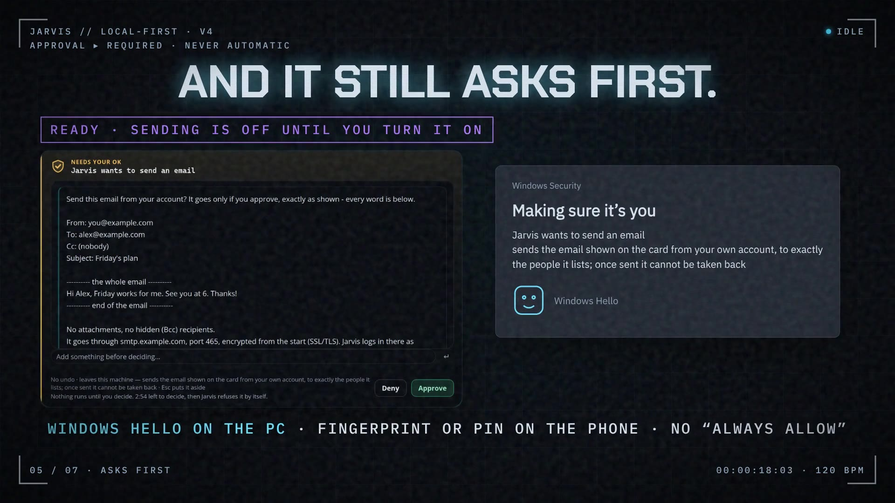

# Launch videos

Every version is kept. The newest is at the top. Tap a picture to watch.

## v5 — "A day with Jarvis" (34 s, plus a 16 s upright cut)

A completely new style: one ordinary day, from 7:30 in the morning to 23:00
at night, in one continuous shot with no cuts. The sky changes with the hour,
and the app's screens go from its light theme by day to its dark theme at
night. Along the way:
- "Brief me now." (a morning briefing made without the AI model);
- a focus session ("YouTube can wait.");
- "Tell me when" an email arrives, and the phone rings until you look;
- a fact learned from your own words, with Forget and "Erase the words";
- one tap on the phone to put Jarvis on Standby, which frees the graphics card.

Every screen is the real desktop app with made-up examples, the phones are
drawn with the app's own words, and `v5/brag-plan.md` lists where each claim
is in the code. The music is new too: a relaxed, warm groove that follows the
day.

For a phone held upright: [the 16-second cut](v5/jarvis-launch-v5-vertical.mp4).

## v4 — "Cutting-edge. And it still asks first." (30 s, plus a 15 s upright cut)

v2's fast, punchy style again, now with Jarvis's newest features:
- focus sessions ("YouTube can wait.");
- "Tell me when" alerts that ring your phone until you look;
- Alt+Shift+X to stop everything;
- a Windows Hello check before sending an email (ready);
- answers that need no AI model;
- a memory with "Erase the words".

Every screen is the real desktop app with made-up examples, and
`v4/brag-plan.md` lists where each claim is in the code.

For a phone held upright: [the 15-second cut](v4/jarvis-launch-v4-vertical.mp4).

## v3 — "It asks first" (32 s, plus a 15 s upright cut)

One idea: Jarvis does nothing, and keeps nothing, until you say so. It asks
before it acts, and your phone checks it's you. The example is a visible
browser renewing a library book, only on the one site you approved (built,
and switched on once a second graphics card is in). It asks before it remembers something about you, and it keeps a history
of what changed. And when you say "stop", it stops. Every screen is the real
desktop app, and every spoken line is captioned.

For a phone held upright: [the 15-second cut](v3/jarvis-launch-v3-vertical.mp4).

Made after a team review of v2: editors, an AI developer, a music producer, an
ad specialist, and five everyday viewers, who then reviewed v3 itself too. `v3/brag-plan.md` has what changed
and why, and where each claim is in the code.

## v2 — "It learns. It adapts. It scales." (35 s)

How Jarvis learns you over time (it proposes facts, keeps only the ones you
accept, and remembers what changed), learns your voice, waits while you
think, and asks before it acts. Then how it scales: one graphics card today,
ready for a second card and a big model, and next, a design for any 8 GB card
and up to two cards. Each claim is labelled on screen as **today**, **ready**
or **next**, and `v2/brag-plan.md` lists where each one is in the code.

## v1 — "Your assistant. Your PC. Your rules." (25 s)

The first beat-cut video: the reactor faces, "Hey Jarvis", being cut off
with "stop", the phone approval card, and the private link between desktop
and phone.

## How each folder is laid out

- `jarvis-launch-vN.mp4` — the video. `jarvis-launch-vN.jpg` — its poster.
- `brag-plan.md` — the plan and storyboard. `composition-brief.md` — how it was built.
- `share-copy.txt` — a caption to post with it.
- `composition/` — the Hyperframes project, to make the video again.
  The faces come from the app's own code (`tools/extract-reactor.mjs`) and the
  music is made by `tools/score.py`.
