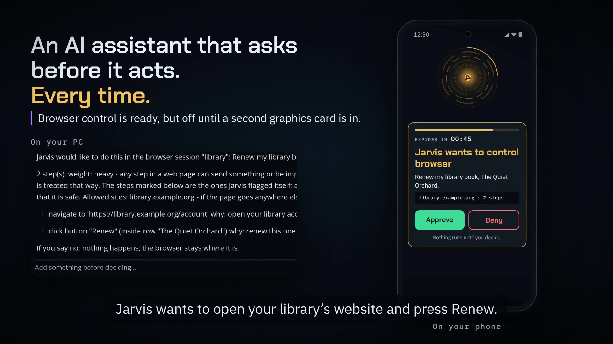
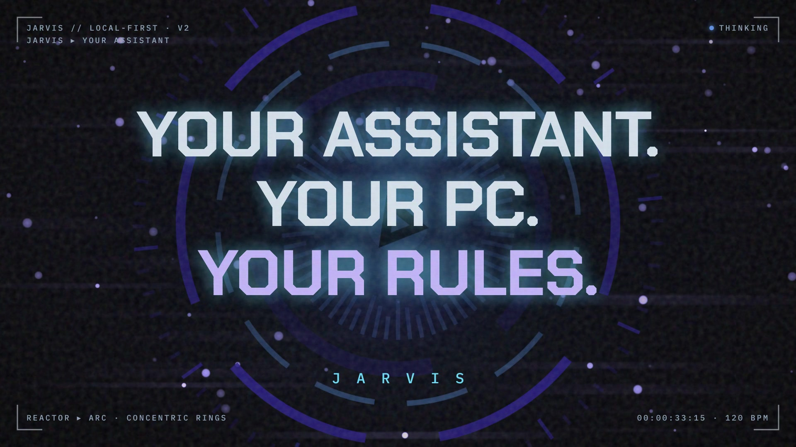
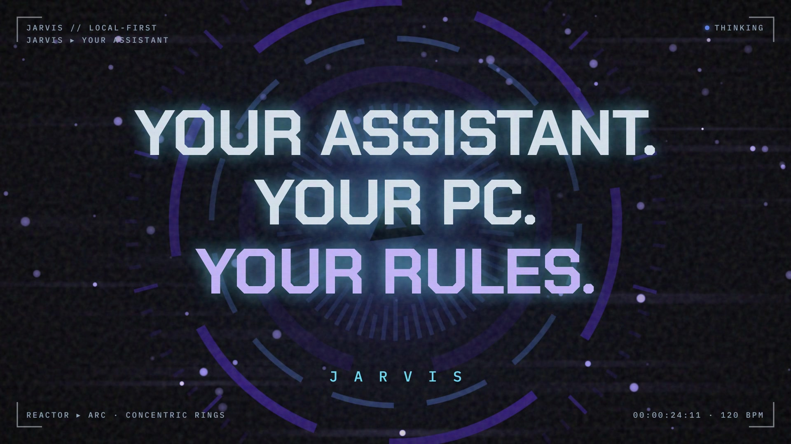

# Launch videos

Every version is kept. The newest is at the top. Tap a picture to watch.

## v3 — "It asks first" (35 s, plus a 15 s upright cut)

One idea: Jarvis does nothing, and keeps nothing, until you say so. It asks
before it runs a command on your PC, and your phone wants a fingerprint for
it. It asks before it remembers something about you, and it keeps a history
of what changed. And when you say "stop", it stops. Every screen is the real
desktop app, and every spoken line is captioned.

For a phone held upright: [the 15-second cut](v3/jarvis-launch-v3-vertical.mp4).

Made after a team review of v2: editors, an AI developer, a music producer, an
ad specialist, and four everyday viewers. `v3/brag-plan.md` has what changed
and why, and where each claim is in the code.

## v2 — "It learns. It adapts. It scales." (35 s)

How Jarvis learns you over time (it proposes facts, keeps only the ones you
accept, and remembers what changed), learns your voice, waits while you
think, and asks before it acts. Then how it scales: one graphics card today,
ready for a second card and a big model, and next, a design for any 8 GB card
and up to two cards. Each claim is labelled on screen as **today**, **ready**
or **next**, and `v2/brag-plan.md` lists where each one is in the code.

## v1 — "Your assistant. Your PC. Your rules." (25 s)

The first beat-cut video: the reactor faces, "Hey Jarvis", being cut off
with "stop", the phone approval card, and the private link between desktop
and phone.

## How each folder is laid out

- `jarvis-launch-vN.mp4` — the video. `jarvis-launch-vN.jpg` — its poster.
- `brag-plan.md` — the plan and storyboard. `composition-brief.md` — how it was built.
- `share-copy.txt` — a caption to post with it.
- `composition/` — the Hyperframes project, to make the video again.
  The faces come from the app's own code (`tools/extract-reactor.mjs`) and the
  music is made by `tools/score.py`.
